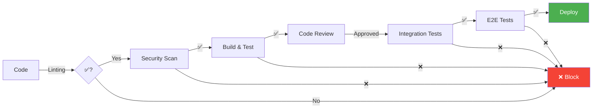

## 🚀 Proposta de Modernização CI/CD

### Apresentação Executiva

---

## 📊 Sumário Executivo

### Situação Atual

- Pipeline CI/CD parcialmente implementado
- Falta de padronização entre projetos (API, Agent, Model Serving)
- Ausência de gates de qualidade consistentes
- Processo de deploy manual e propenso a erros
- Tempo médio de deploy: **4-6 horas**
- Taxa de falha em produção: **~15%**

### Proposta

Implementação de pipeline CI/CD moderno, automatizado e seguro que reduz tempo de deploy em 80% e falhas em 70%.

### ROI Esperado

- 💰 **Redução de custos**: $50k-100k/ano (menos incidentes)
- ⏱️ **Ganho de tempo**: 200+ horas/mês da equipe
- 🎯 **Qualidade**: -70% bugs em produção
- 🚀 **Velocidade**: Deploy em minutos vs horas

---

## 🎯 Objetivos e Benefícios

### Para o Negócio

✅ **Time-to-Market 80% mais rápido**

- De 4-6 horas → 30-60 minutos para deploy
- Múltiplos deploys por dia se necessário
- Resposta rápida a incidentes críticos

✅ **Redução de 70% em bugs de produção**

- Gates de qualidade automatizados
- Testes abrangentes em todos os níveis
- Validação contínua de segurança

✅ **Compliance e Auditoria**

- Rastreabilidade completa (quem, quando, o quê)
- Aprovações formalizadas
- Logs imutáveis de todas as mudanças

### Para Engenharia

✅ **Produtividade +40%**

- Menos tempo corrigindo bugs
- Automação de tarefas repetitivas
- Foco em desenvolvimento, não em deploy

✅ **Confiança e Segurança**

- Rollback automático em caso de problemas
- Ambientes consistentes (dev = prod)
- Testes automatizados antes de cada merge

✅ **Observabilidade**

- Visibilidade completa do pipeline
- Métricas em tempo real
- Alertas proativos

---

## 🏗️ Arquitetura Proposta

### Visão Geral dos Fluxos

```text
DESENVOLVIMENTO → CI → DEPLOY DEV → RELEASE → DEPLOY HML → VALIDAÇÃO → DEPLOY PRD
    (local)     (auto)   (auto)      (manual)    (manual)     (QA)      (progressive)
```

### Ambientes

| Ambiente | Propósito              | Deploy               | Dados           | SLA         |
| -------- | ---------------------- | -------------------- | --------------- | ----------- |
| **DEV**  | Desenvolvimento ativo  | Automático           | Mock/Sintéticos | Best effort |
| **HML**  | Validação pré-produção | Manual               | Anonimizados    | 95%         |
| **PRD**  | Produção               | Manual + Progressive | Reais           | 99.9%       |

### Gates de Qualidade



---

## 📈 Fases de Implementação

### 🔵 Fase 1: Foundation (Mês 1-2)

**Objetivo**: Estabelecer base do pipeline

**Entregas**:

- ✅ GitFlow padronizado
- ✅ Pre-commit hooks (linting, formatting, secrets)
- ✅ CI básico (lint → build → test)
- ✅ Ambiente DEV automatizado

**Métricas de Sucesso**:

- 100% dos commits passando por pre-commit hooks
- Pipeline CI executando em < 10 min
- DEV deploy automático funcionando

**Esforço**: 80-120 horas
**Investimento**: $5k-10k (ferramentas)

---

### 🟢 Fase 2: Quality & Security (Mês 3-4)

**Objetivo**: Adicionar camadas de qualidade e segurança

**Entregas**:

- ✅ Integration tests automatizados
- ✅ Security scanning (SAST, dependency check)
- ✅ SonarQube/code quality gates
- ✅ Ambiente HML com deploy manual

**Métricas de Sucesso**:

- Code coverage > 80%
- Zero vulnerabilidades HIGH/CRITICAL em prod
- Quality gate blocking PRs inadequados

**Esforço**: 100-150 horas
**Investimento**: $10k-15k (ferramentas + infra HML)

---

### 🟡 Fase 3: Advanced & Production (Mês 5-6)

**Objetivo**: Deploy seguro em produção

**Entregas**:

- ✅ E2E tests abrangentes (Cypress/Playwright)
- ✅ Progressive deployment (canary/blue-green)
- ✅ Observabilidade completa (APM, logs, metrics)
- ✅ Automated rollback

**Métricas de Sucesso**:

- Deploy para prod em < 1 hora
- Zero downtime nos deploys
- Rollback automático funcionando

**Esforço**: 150-200 horas
**Investimento**: $15k-25k (observability stack)

---

### 🟣 Fase 4: Optimization (Mês 7+)

**Objetivo**: Otimização e melhoria contínua

**Entregas**:

- ✅ Performance tuning (cache, parallelização)
- ✅ Cost optimization (spot instances, scaling)
- ✅ Advanced monitoring e dashboards
- ✅ Chaos engineering (optional)

**Métricas de Sucesso**:

- Pipeline execution time -50%
- Infrastructure cost -30%
- MTTR (Mean Time To Recovery) < 30 min

**Esforço**: Contínuo
**Investimento**: Incremental

---

## 💰 Análise de Custos

### Investimento Inicial

| Item                            | Custo Mensal          | Custo Anual    |
| ------------------------------- | --------------------- | -------------- |
| **Ferramentas**                 |                       |                |
| CI/CD Platform (GitHub Actions) | $500-2,000            | $6k-24k        |
| Code Quality (SonarQube)        | $300-1,000            | $3.6k-12k      |
| Security (Snyk, Trivy)          | $500-1,500            | $6k-18k        |
| Observability (Datadog)         | $1,000-3,000          | $12k-36k       |
| Testing (Cypress Cloud)         | $300-1,000            | $3.6k-12k      |
| **Subtotal Ferramentas**        | **$2,600-8,500**      | **$31k-102k**  |
|                                 |                       |                |
| **Infraestrutura**              |                       |                |
| DEV Environment                 | $500-1,000            | $6k-12k        |
| HML Environment                 | $1,500-3,000          | $18k-36k       |
| PRD (incremental)               | $2,000-5,000          | $24k-60k       |
| **Subtotal Infra**              | **$4,000-9,000**      | **$48k-108k**  |
|                                 |                       |                |
| **Implementação (one-time)**    |                       |                |
| Consulting/Setup                | -                     | $50k-100k      |
| Training                        | -                     | $10k-20k       |
| **Subtotal Impl**               | -                     | **$60k-120k**  |
|                                 |                       |                |
| **TOTAL Ano 1**                 | **$6,600-17,500/mês** | **$139k-330k** |
| **TOTAL Ano 2+**                | **$6,600-17,500/mês** | **$79k-210k**  |

### Retorno do Investimento (ROI)

#### Economia Direta

- **Redução de incidentes**: $100k-200k/ano

  - Menos downtime
  - Menos hotfixes emergenciais
  - Menos horas extras

- **Ganho de produtividade**: $150k-300k/ano
  - 200h/mês × $150/h × 12 meses
  - Equipe de 10 engenheiros
  - 20% do tempo economizado em deploy/bugs

#### Economia Indireta

- **Reputação**: Menos incidentes = clientes mais felizes
- **Compliance**: Auditoria facilitada
- **Recrutamento**: Engenheiros preferem ambientes modernos

#### ROI Consolidado

```text
Ano 1:
Investimento: $139k-330k
Retorno:      $250k-500k
ROI:          80%-50% (payback em 6-12 meses)

Ano 2+:
Investimento: $79k-210k
Retorno:      $250k-500k
ROI:          220%-140%
```

---

## 📊 Métricas de Sucesso (KPIs)

### Performance

| Métrica                 | Atual      | Meta          | Impacto  |
| ----------------------- | ---------- | ------------- | -------- |
| **Lead Time**           | 4-6 horas  | < 1 hora      | 🚀 -83%  |
| **Deploy Frequency**    | 2-3/semana | Múltiplos/dia | 🚀 +500% |
| **Change Failure Rate** | ~15%       | < 5%          | ✅ -67%  |
| **MTTR**                | 2-4 horas  | < 1 hora      | ⚡ -75%  |

### Qualidade

| Métrica              | Atual         | Meta            | Impacto  |
| -------------------- | ------------- | --------------- | -------- |
| **Code Coverage**    | 40-60%        | > 80%           | ✅ +40%  |
| **Bugs em Produção** | 10-15/mês     | 3-5/mês         | ✅ -70%  |
| **Security Vulns**   | Não rastreado | 0 HIGH/CRITICAL | 🔒 +100% |

### Eficiência

| Métrica                    | Atual     | Meta     | Impacto   |
| -------------------------- | --------- | -------- | --------- |
| **Pipeline Success Rate**  | ~70%      | > 95%    | ✅ +36%   |
| **Build Time**             | 15-20 min | < 10 min | ⚡ -50%   |
| **Developer Satisfaction** | N/A       | 8+/10    | 😊 Melhor |

---

## 🎨 Dashboards Propostos

### 1️⃣ CI/CD Health Dashboard

**Audiência**: DevOps, Engineering Leadership

**Métricas Principais**:

- Pipeline success rate (por hora/dia)
- Average build time
- Queue wait times
- Resource utilization

**Alertas**:

- ⚠️ Success rate < 90%
- ⚠️ Build time > 15 min
- 🚨 Pipeline down

---

### 2️⃣ Deployment Dashboard

**Audiência**: Product, Engineering, Operations

**Métricas Principais**:

- Deploys por ambiente (dia/semana)
- Deployment frequency trend
- Rollback rate
- Deployment duration

**Alertas**:

- 🚨 Rollback triggered
- ⚠️ Canary metrics unhealthy
- ⚠️ Deployment > 30 min

---

### 3️⃣ Quality Dashboard

**Audiência**: Engineering, QA

**Métricas Principais**:

- Code coverage trend
- Technical debt (SonarQube)
- Security vulnerabilities
- Test execution time

**Alertas**:

- 🚨 Coverage dropped below 80%
- 🚨 CRITICAL vulnerability found
- ⚠️ Technical debt increasing

---

## 🔐 Segurança e Compliance

### Controles de Segurança

#### Pre-Production

✅ **Secret scanning** (pre-commit)
✅ **SAST** - Static Application Security Testing
✅ **Dependency scanning** (Snyk)
✅ **License compliance**

#### Pre-Release

✅ **DAST** - Dynamic Application Security Testing
✅ **Container scanning** (Trivy)
✅ **Infrastructure scanning** (Terraform)

#### Production

✅ **Runtime security** (Falco)
✅ **Network policies** (Kubernetes)
✅ **Audit logging** (CloudTrail)
✅ **Secrets management** (Vault/AWS Secrets Manager)

### Compliance

| Framework     | Status     | Controles                   |
| ------------- | ---------- | --------------------------- |
| **LGPD**      | ✅ Ready   | Data masking em não-PRD     |
| **SOC 2**     | ✅ Ready   | Audit trail completo        |
| **ISO 27001** | ⚠️ Partial | Access controls, encryption |

---

## 👥 Impacto nas Equipes

### Desenvolvedores

**Antes**:

- ❌ Espera manual por aprovações
- ❌ Deploy manual propenso a erros
- ❌ Incerteza sobre qualidade do código
- ❌ Tempo perdido com bugs em produção

**Depois**:

- ✅ Feedback imediato sobre código
- ✅ Deploy automático e confiável
- ✅ Confiança na qualidade (gates)
- ✅ Foco em features, não em infra

### QA

**Antes**:

- ❌ Testes manuais repetitivos
- ❌ Ambientes inconsistentes
- ❌ Falta de visibilidade

**Depois**:

- ✅ Testes automatizados
- ✅ Ambientes reproduzíveis
- ✅ Dashboards e métricas claras

### Operations/SRE

**Antes**:

- ❌ Deploys manuais e estressantes
- ❌ Incidentes frequentes
- ❌ Dificuldade em troubleshooting

**Depois**:

- ✅ Deploys automatizados
- ✅ Rollback automático
- ✅ Observabilidade completa

### Product/Leadership

**Antes**:

- ❌ Lentidão para lançar features
- ❌ Incidentes afetam usuários
- ❌ Falta de previsibilidade

**Depois**:

- ✅ Time-to-market rápido
- ✅ Qualidade consistente
- ✅ Métricas e previsibilidade

---

## 🚧 Riscos e Mitigações

### Riscos Identificados

| Risco                              | Probabilidade | Impacto | Mitigação                                |
| ---------------------------------- | ------------- | ------- | ---------------------------------------- |
| **Resistência à mudança**          | Alta          | Médio   | Treinamento extensivo, rollout gradual   |
| **Complexidade inicial**           | Média         | Alto    | Começar simples, iterar                  |
| **Downtime durante implementação** | Baixa         | Alto    | Implementar em paralelo ao sistema atual |
| **Custo acima do esperado**        | Média         | Médio   | Começar com ferramentas open-source      |
| **Falta de expertise**             | Média         | Alto    | Contratar consultoria especializada      |
| **Falha de integração**            | Baixa         | Alto    | PoC antes de rollout completo            |

### Plano de Rollback

Se necessário reverter para processo atual:

1. Manter sistema antigo em paralelo (primeiros 3 meses)
2. Documentação completa do processo antigo
3. Training de contingência
4. Período de adaptação de 1 mês

---

## 📅 Timeline e Milestones

```text
Mês 1-2: FOUNDATION
├── Semana 1-2: Setup e GitFlow
├── Semana 3-4: Pre-commit hooks
├── Semana 5-6: CI básico
└── Semana 7-8: DEV automation
    └── ✅ Milestone: DEV deploy automático

Mês 3-4: QUALITY & SECURITY
├── Semana 9-10: Integration tests
├── Semana 11-12: Security scanning
├── Semana 13-14: Code quality gates
└── Semana 15-16: HML environment
    └── ✅ Milestone: HML com full validation

Mês 5-6: ADVANCED & PRODUCTION
├── Semana 17-18: E2E tests
├── Semana 19-20: Progressive deployment
├── Semana 21-22: Observability
└── Semana 23-24: Rollback automation
    └── ✅ Milestone: PRD deploys confiáveis

Mês 7+: OPTIMIZATION
└── Continuous improvement
    └── ✅ Ongoing: Métricas, otimizações
```

---

## ✅ Critérios de Sucesso

### Mês 3 (Fase 1 Completa)

- ✅ 100% dos commits passando por pre-commit hooks
- ✅ Pipeline CI executando em < 10 min
- ✅ DEV deploy automático em < 5 min
- ✅ Zero deployments manuais em DEV

### Mês 6 (Fase 2 Completa)

- ✅ Code coverage > 80%
- ✅ Zero vulnerabilidades CRITICAL em code review
- ✅ Quality gates bloqueando 100% dos PRs inadequados
- ✅ HML deploys < 30 min

### Mês 9 (Fase 3 Completa)

- ✅ PRD deploys em < 60 min
- ✅ Zero downtime em deploys
- ✅ Change failure rate < 5%
- ✅ MTTR < 1 hora
- ✅ Developer satisfaction > 8/10

---

## 🎯 Recomendações Finais

### Prioridades Imediatas (30 dias)

1. ✅ **Aprovar proposta** e alocar budget
2. ✅ **Formar squad** dedicado (2-3 pessoas)
3. ✅ **Escolher ferramentas** (GitHub Actions vs GitLab CI)
4. ✅ **Setup inicial** de GitFlow e pre-commit hooks
5. ✅ **PoC em 1 projeto** piloto

### Médio Prazo (90 dias)

1. ✅ **Completar Fase 1** (Foundation)
2. ✅ **Treinar equipe** em novos processos
3. ✅ **Implementar Fase 2** (Quality & Security)
4. ✅ **Migrar 2-3 projetos** para novo pipeline

### Longo Prazo (180 dias)

1. ✅ **Completar Fase 3** (Production)
2. ✅ **Migrar todos os projetos**
3. ✅ **Otimização contínua**
4. ✅ **Compartilhar best practices** internamente

---

## 📞 Próximos Passos

### Ação Imediata

1. **Apresentação para stakeholders**

   - CTO/VP Engineering
   - Head of DevOps
   - Product Leadership

2. **Workshop técnico** (4 horas)

   - Deep dive na arquitetura
   - Hands-on com ferramentas
   - Q&A com time técnico

3. **Definir squad e budget**

   - 2-3 engineers dedicados
   - $150k-350k Year 1
   - $80k-210k Year 2+

4. **Kick-off em 2 semanas**

---

## 📚 Recursos Adicionais

### Documentação Técnica Detalhada

- ✅ `proposta_cicd_pipeline.md` - Especificação completa
- ✅ `diagramas_cicd.md` - Diagramas Mermaid
- ✅ `exemplos_configuracao_cicd.md` - Código pronto para uso

### Referências

- [GitHub Actions Best Practices](https://docs.github.com/en/actions)
- [GitLab CI/CD](https://docs.gitlab.com/ee/ci/)
- [DORA Metrics](https://www.devops-research.com/research.html)
- [Accelerate Book](https://www.amazon.com/Accelerate-Software-Performing-Technology-Organizations/dp/1942788339)

---

## 🙋 Perguntas Frequentes

**Q: Quanto tempo até ver resultados?**
A: Primeiros benefícios em 30-60 dias (Fase 1). ROI completo em 6-9 meses.

**Q: Podemos implementar gradualmente?**
A: Sim! Recomendamos começar com 1 projeto piloto, depois expandir.

**Q: E se tivermos problemas?**
A: Mantemos sistema antigo em paralelo. Rollback disponível sempre.

**Q: Precisa de consultoria externa?**
A: Recomendado para acelerar (2-4 semanas), mas não obrigatório.

**Q: Funciona com nossa stack atual?**
A: Sim! Pipeline é agnóstico de linguagem/framework.

**Q: E a curva de aprendizado?**
A: Training intensivo no início (2 semanas). Depois, day-to-day.

---

## ✨ Conclusão

Esta proposta de modernização CI/CD oferece:

🎯 **Impacto Mensurável**: ROI de 80-220%, redução de 70% em bugs

🚀 **Velocidade**: Deploy 80% mais rápido, múltiplos deploys/dia

🔒 **Segurança**: Gates automatizados, compliance built-in

💰 **Custo-benefício**: Payback em 6-12 meses

🌟 **Cultura**: Engenharia moderna, desenvolvedores felizes

**A modernização não é uma opção, é uma necessidade competitiva.**

Empresas com CI/CD maduro deployam 200x mais frequentemente e têm 2,555x menor MTTR que a concorrência (DORA Research).

**Estamos prontos para liderar essa transformação.**

---

_Preparado por: Arquiteto de Soluções_
_Data: Novembro 2025_
_Versão: 1.0_
