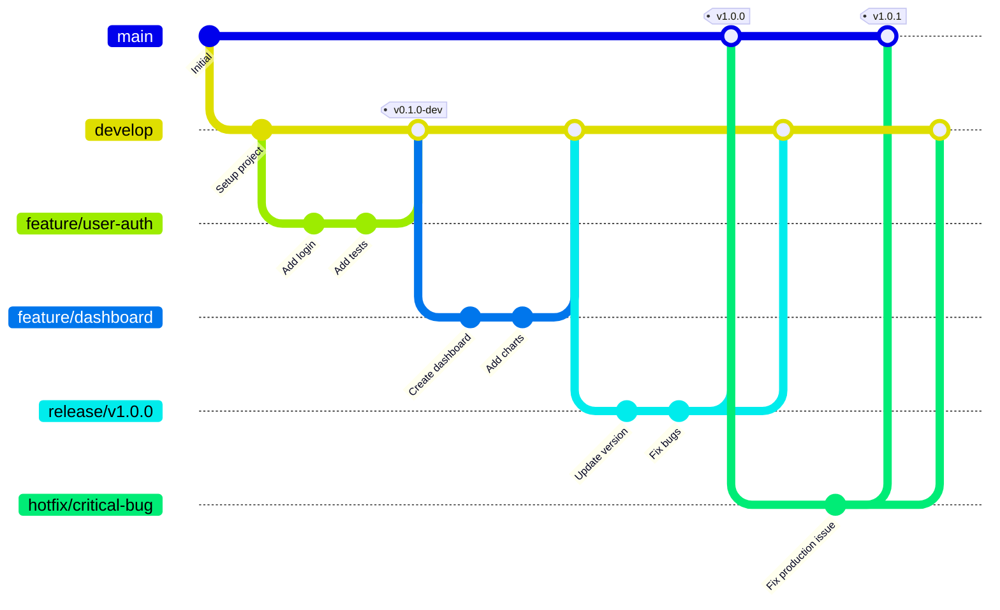
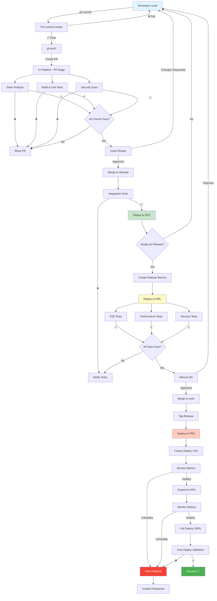
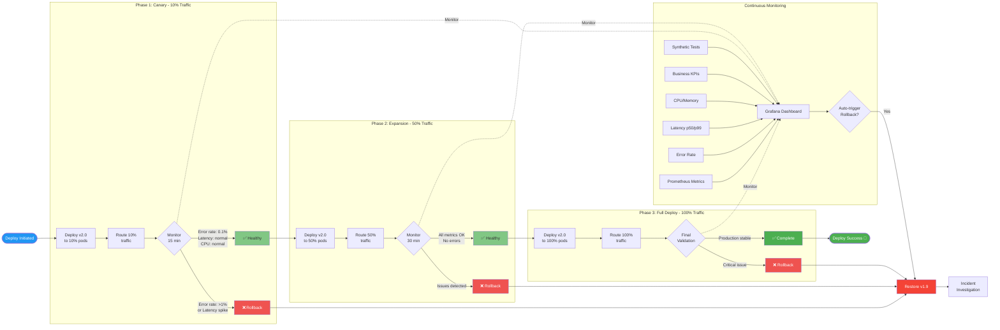
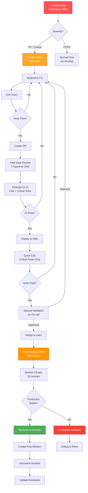
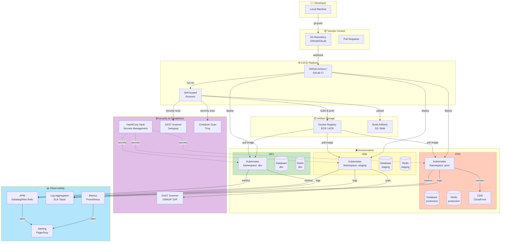
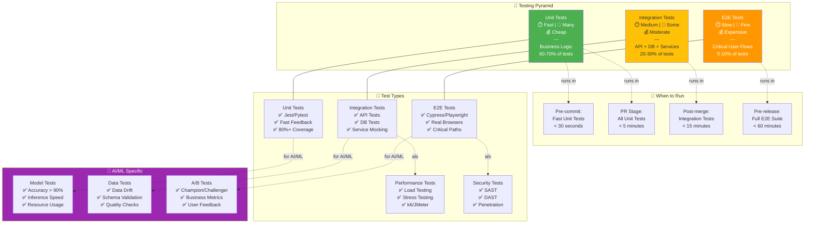

## Diagramas CI/CD Pipeline

## Diagrama 1: GitFlow Strategy

---

## Diagrama 2: Pipeline Completo - Visão Geral

---

## Diagrama 3: Pipeline Detalhado por Fase

```mermaid
flowchart TB
    subgraph LOCAL["🏠 LOCAL - Developer Machine"]
        L1[Write Code] --> L2[git add]
        L2 --> L3[Pre-commit Hook Triggered]
        L3 --> L4[Linting]
        L3 --> L5[Formatting]
        L3 --> L6[Type Check]
        L3 --> L7[Secret Scan]
        L4 --> L8{All Pass?}
        L5 --> L8
        L6 --> L8
        L7 --> L8
        L8 -->|Yes| L9[Commit Created]
        L8 -->|No| L10[Fix Issues]
        L10 --> L1
    end

    subgraph PR["📝 PULL REQUEST Stage"]
        P1[Push to Remote] --> P2[Create PR]
        P2 --> P3[Trigger CI]

        P3 --> P4[Static Analysis]
        P3 --> P5[Build]
        P3 --> P6[Unit Tests]
        P3 --> P7[Security SAST]
        P3 --> P8[Dependency Check]

        P4 --> P9{Quality Gates}
        P5 --> P9
        P6 --> P9
        P7 --> P9
        P8 --> P9

        P9 -->|✅ 80%+ coverage<br/>✅ No critical bugs<br/>✅ Build success| P10[Ready for Review]
        P9 -->|❌| P11[Fix Required]
    end

    subgraph DEV["🔧 DEV Environment"]
        D1[Merge to develop] --> D2[Integration Tests]
        D2 --> D3[Build Docker Image]
        D3 --> D4[Push to Registry]
        D4 --> D5[Deploy to K8s/ECS]
        D5 --> D6[Health Checks]
        D6 --> D7[Smoke Tests]
        D7 -->|✅| D8[Notify: Deploy Success]
        D7 -->|❌| D9[Rollback & Alert]
    end

    subgraph HML["✅ HML Environment"]
        H1[Create release/v*.*.*] --> H2[Deploy Infrastructure]
        H2 --> H3[Blue-Green Deploy]
        H3 --> H4[Database Migration]
        H4 --> H5[E2E Tests Suite]
        H5 --> H6[Performance Tests]
        H5 --> H7[Security DAST]
        H5 --> H8[Accuracy Tests AI/ML]

        H6 --> H9{All Tests Pass?}
        H7 --> H9
        H8 --> H9

        H9 -->|✅| H10[Manual QA]
        H9 -->|❌| H11[Debug & Fix]

        H10 -->|Approved| H12[Ready for Production]
        H10 -->|Rejected| H11
    end

    subgraph PRD["🚀 PRODUCTION Environment"]
        Pr1[Merge to main] --> Pr2[Create Git Tag]
        Pr2 --> Pr3[Generate Changelog]
        Pr3 --> Pr4[Build Production Image]
        Pr4 --> Pr5[Security Scan Image]
        Pr5 -->|✅| Pr6[Canary Deploy 10%]
        Pr5 -->|❌| Pr7[Block Deploy]

        Pr6 --> Pr8[Monitor 15min]
        Pr8 -->|Error rate OK<br/>Latency OK| Pr9[Expand to 50%]
        Pr8 -->|Metrics Bad| Pr10[Auto Rollback]

        Pr9 --> Pr11[Monitor 30min]
        Pr11 -->|Healthy| Pr12[Full Deploy 100%]
        Pr11 -->|Unhealthy| Pr10

        Pr12 --> Pr13[Synthetic Tests]
        Pr13 -->|✅| Pr14[Success!]
        Pr13 -->|❌| Pr10

        Pr10 --> Pr15[Incident & Post-Mortem]
    end

    L9 --> P1
    P10 --> D1
    D8 --> H1
    H12 --> Pr1

    style L9 fill:#81c784
    style P10 fill:#81c784
    style D8 fill:#81c784
    style H12 fill:#81c784
    style Pr14 fill:#4caf50,color:#fff
    style Pr10 fill:#f44336,color:#fff
```

---

## Diagrama 4: Estratégia de Deploy Progressivo

---

## Diagrama 5: Fluxo de Hotfix Emergencial

---

## Diagrama 6: Ambientes e Fluxo de Dados

---

## Diagrama 7: Testing Strategy - Pirâmide de Testes

---

## Diagrama 8: Matriz de Responsabilidades (RACI)

```mermaid
flowchart TD
    subgraph Roles["👥 Roles & Responsibilities"]
        DEV["Developer<br/>💻"]
        QA["QA Engineer<br/>🧪"]
        OPS["DevOps/SRE<br/>⚙️"]
        SEC["Security Team<br/>🔒"]
        PM["Product Manager<br/>📊"]
    end

    subgraph Activities["📋 Activities"]
        A1["Code Development<br/>R: DEV | A: DEV | C: QA | I: PM"]
        A2["Unit Testing<br/>R: DEV | A: DEV | C: QA"]
        A3["Code Review<br/>R: DEV | A: DEV | C: QA,OPS"]
        A4["Integration Tests<br/>R: QA | A: DEV | C: OPS"]
        A5["Security Scan<br/>R: SEC | A: SEC | C: DEV,OPS | I: ALL"]
        A6["E2E Testing<br/>R: QA | A: QA | C: DEV,PM"]
        A7["Deploy to DEV<br/>R: OPS | A: DEV | C: QA"]
        A8["Deploy to HML<br/>R: OPS | A: OPS | C: QA,PM"]
        A9["Production Deploy<br/>R: OPS | A: PM | C: DEV,QA,SEC"]
        A10["Monitoring<br/>R: OPS | A: OPS | C: DEV | I: ALL"]
        A11["Incident Response<br/>R: OPS | A: OPS | C: DEV,SEC | I: PM"]
    end

    DEV -.responsible.-> A1
    DEV -.responsible.-> A2
    DEV -.responsible.-> A3

    QA -.responsible.-> A4
    QA -.responsible.-> A6

    SEC -.responsible.-> A5

    OPS -.responsible.-> A7
    OPS -.responsible.-> A8
    OPS -.responsible.-> A9
    OPS -.responsible.-> A10
    OPS -.responsible.-> A11

    PM -.accountable.-> A9

    style DEV fill:#64b5f6
    style QA fill:#81c784
    style OPS fill:#ff9800,color:#fff
    style SEC fill:#e91e63,color:#fff
    style PM fill:#9c27b0,color:#fff

    style A9 fill:#f44336,color:#fff
```

---

## Como Usar Estes Diagramas

### No GitHub/GitLab

Os diagramas Mermaid são renderizados automaticamente em:

- README.md
- Pull Requests
- Issues
- Wiki pages

### Em Apresentações

1. **Copie o código Mermaid** para ferramentas como:

   - [Mermaid Live Editor](https://mermaid.live)
   - Draw.io (com plugin Mermaid)
   - VS Code (com extensão Mermaid)

2. **Exporte como imagem** (PNG/SVG) para PowerPoint/Google Slides

### Em Documentação

- Confluence suporta Mermaid via plugin
- Notion suporta blocos de código Mermaid
- Docusaurus/MkDocs renderizam Mermaid nativamente

---

## Legenda de Cores

- 🟢 **Verde** (#4caf50): Sucesso, aprovação, estado saudável
- 🔵 **Azul** (#2196f3): Processos normais, informação
- 🟡 **Amarelo** (#ffc107): Atenção, staging, validação
- 🟠 **Laranja** (#ff9800): Deploy, mudanças, cuidado
- 🔴 **Vermelho** (#f44336): Erro, rollback, crítico
- 🟣 **Roxo** (#9c27b0): Especializado (AI/ML, PM)
- 🟤 **Marrom** (#795548): Infraestrutura, dados
