## Diagramas CI/CD Pipeline

## Diagrama 1: GitFlow Strategy

---

## Diagrama 2: Pipeline Completo - Visão Geral

```mermaid
flowchart TD
    A[Developer Local] -->|git commit| B[Pre-commit Hooks]
    B -->|✅ Pass| C[git push]
    B -->|❌ Fail| A

    C -->|Create PR| D[CI Pipeline - PR Stage]

    D --> E[Static Analysis]
    D --> F[Build & Unit Tests]
    D --> G[Security Scan]

    E -->|✅| H{All Checks Pass?}
    F -->|✅| H
    G -->|✅| H

    E -->|❌| I[Block PR]
    F -->|❌| I
    G -->|❌| I

    H -->|Yes| J[Code Review]
    H -->|No| I

    J -->|Approved| K[Merge to develop]
    J -->|Changes Requested| A

    K --> L[Integration Tests]
    L -->|✅| M[Deploy to DEV]
    L -->|❌| N[Notify Team]

    M --> O{Ready for Release?}

    O -->|Yes| P[Create Release Branch]
    O -->|No| A

    P --> Q[Deploy to HML]
    Q --> R[E2E Tests]
    Q --> S[Performance Tests]
    Q --> T[Security Tests]

    R -->|✅| U{All Tests Pass?}
    S -->|✅| U
    T -->|✅| U

    U -->|Yes| V[Manual QA]
    U -->|No| N

    V -->|Approved| W[Merge to main]
    V -->|Rejected| A

    W --> X[Tag Release]
    X --> Y[Deploy to PRD]

    Y --> Z[Canary Deploy 10%]
    Z --> AA[Monitor Metrics]
    AA -->|Healthy| AB[Expand to 50%]
    AA -->|Unhealthy| AC[Auto Rollback]

    AB --> AD[Monitor Metrics]
    AD -->|Healthy| AE[Full Deploy 100%]
    AD -->|Unhealthy| AC

    AE --> AF[Post-Deploy Validation]
    AF -->|✅| AG[Success! 🎉]
    AF -->|❌| AC

    AC --> AH[Incident Response]

    style A fill:#e1f5ff
    style M fill:#c8e6c9
    style Q fill:#fff9c4
    style Y fill:#ffccbc
    style AG fill:#4caf50,color:#fff
    style AC fill:#f44336,color:#fff
```

---

## Diagrama 3: Pipeline Detalhado por Fase

---

## Diagrama 4: Estratégia de Deploy Progressivo

---

## Diagrama 5: Fluxo de Hotfix Emergencial

---

## Diagrama 6: Ambientes e Fluxo de Dados

---

## Diagrama 7: Testing Strategy - Pirâmide de Testes

```mermaid
graph TD
    subgraph Pyramid["🔺 Testing Pyramid"]
        direction TB
        E2E["E2E Tests<br/>⏱️ Slow | 🎯 Few<br/>💰 Expensive<br/>---<br/>Critical User Flows<br/>5-10% of tests"]
        INT["Integration Tests<br/>⏱️ Medium | 🎯 Some<br/>💰 Moderate<br/>---<br/>API + DB + Services<br/>20-30% of tests"]
        UNIT["Unit Tests<br/>⏱️ Fast | 🎯 Many<br/>💰 Cheap<br/>---<br/>Business Logic<br/>60-70% of tests"]
    end

    subgraph When["📅 When to Run"]
        W1["Pre-commit:<br/>Fast Unit Tests<br/>< 30 seconds"]
        W2["PR Stage:<br/>All Unit Tests<br/>< 5 minutes"]
        W3["Post-merge:<br/>Integration Tests<br/>< 15 minutes"]
        W4["Pre-release:<br/>Full E2E Suite<br/>< 60 minutes"]
    end

    subgraph Types["🧪 Test Types"]
        T1["Unit Tests<br/>✅ Jest/Pytest<br/>✅ Fast Feedback<br/>✅ 80%+ Coverage"]
        T2["Integration Tests<br/>✅ API Tests<br/>✅ DB Tests<br/>✅ Service Mocking"]
        T3["E2E Tests<br/>✅ Cypress/Playwright<br/>✅ Real Browsers<br/>✅ Critical Paths"]
        T4["Performance Tests<br/>✅ Load Testing<br/>✅ Stress Testing<br/>✅ k6/JMeter"]
        T5["Security Tests<br/>✅ SAST<br/>✅ DAST<br/>✅ Penetration"]
    end

    subgraph AI_ML["🤖 AI/ML Specific"]
        ML1["Model Tests<br/>✅ Accuracy > 90%<br/>✅ Inference Speed<br/>✅ Resource Usage"]
        ML2["Data Tests<br/>✅ Data Drift<br/>✅ Schema Validation<br/>✅ Quality Checks"]
        ML3["A/B Tests<br/>✅ Champion/Challenger<br/>✅ Business Metrics<br/>✅ User Feedback"]
    end

    E2E -.runs in.-> W4
    INT -.runs in.-> W3
    UNIT -.runs in.-> W1
    UNIT -.runs in.-> W2

    UNIT --- T1
    INT --- T2
    E2E --- T3

    T2 -.also.-> T4
    T3 -.also.-> T5

    T1 -.for AI/ML.-> ML1
    T2 -.for AI/ML.-> ML2
    T3 -.for AI/ML.-> ML3

    style E2E fill:#ff9800,color:#fff
    style INT fill:#ffc107
    style UNIT fill:#4caf50,color:#fff
    style AI_ML fill:#9c27b0,color:#fff
```

---

## Diagrama 8: Matriz de Responsabilidades (RACI)

```mermaid
flowchart TD
    subgraph Roles["👥 Roles & Responsibilities"]
        DEV["Developer<br/>💻"]
        QA["QA Engineer<br/>🧪"]
        OPS["DevOps/SRE<br/>⚙️"]
        SEC["Security Team<br/>🔒"]
        PM["Product Manager<br/>📊"]
    end

    subgraph Activities["📋 Activities"]
        A1["Code Development<br/>R: DEV | A: DEV | C: QA | I: PM"]
        A2["Unit Testing<br/>R: DEV | A: DEV | C: QA"]
        A3["Code Review<br/>R: DEV | A: DEV | C: QA,OPS"]
        A4["Integration Tests<br/>R: QA | A: DEV | C: OPS"]
        A5["Security Scan<br/>R: SEC | A: SEC | C: DEV,OPS | I: ALL"]
        A6["E2E Testing<br/>R: QA | A: QA | C: DEV,PM"]
        A7["Deploy to DEV<br/>R: OPS | A: DEV | C: QA"]
        A8["Deploy to HML<br/>R: OPS | A: OPS | C: QA,PM"]
        A9["Production Deploy<br/>R: OPS | A: PM | C: DEV,QA,SEC"]
        A10["Monitoring<br/>R: OPS | A: OPS | C: DEV | I: ALL"]
        A11["Incident Response<br/>R: OPS | A: OPS | C: DEV,SEC | I: PM"]
    end

    DEV -.responsible.-> A1
    DEV -.responsible.-> A2
    DEV -.responsible.-> A3

    QA -.responsible.-> A4
    QA -.responsible.-> A6

    SEC -.responsible.-> A5

    OPS -.responsible.-> A7
    OPS -.responsible.-> A8
    OPS -.responsible.-> A9
    OPS -.responsible.-> A10
    OPS -.responsible.-> A11

    PM -.accountable.-> A9

    style DEV fill:#64b5f6
    style QA fill:#81c784
    style OPS fill:#ff9800,color:#fff
    style SEC fill:#e91e63,color:#fff
    style PM fill:#9c27b0,color:#fff

    style A9 fill:#f44336,color:#fff
```

---

## Como Usar Estes Diagramas

### No GitHub/GitLab

Os diagramas Mermaid são renderizados automaticamente em:

- README.md
- Pull Requests
- Issues
- Wiki pages

### Em Apresentações

1. **Copie o código Mermaid** para ferramentas como:

   - [Mermaid Live Editor](https://mermaid.live)
   - Draw.io (com plugin Mermaid)
   - VS Code (com extensão Mermaid)

2. **Exporte como imagem** (PNG/SVG) para PowerPoint/Google Slides

### Em Documentação

- Confluence suporta Mermaid via plugin
- Notion suporta blocos de código Mermaid
- Docusaurus/MkDocs renderizam Mermaid nativamente

---

## Legenda de Cores

- 🟢 **Verde** (#4caf50): Sucesso, aprovação, estado saudável
- 🔵 **Azul** (#2196f3): Processos normais, informação
- 🟡 **Amarelo** (#ffc107): Atenção, staging, validação
- 🟠 **Laranja** (#ff9800): Deploy, mudanças, cuidado
- 🔴 **Vermelho** (#f44336): Erro, rollback, crítico
- 🟣 **Roxo** (#9c27b0): Especializado (AI/ML, PM)
- 🟤 **Marrom** (#795548): Infraestrutura, dados
