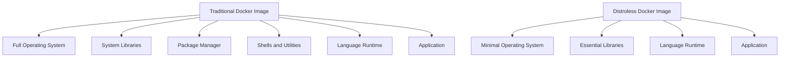
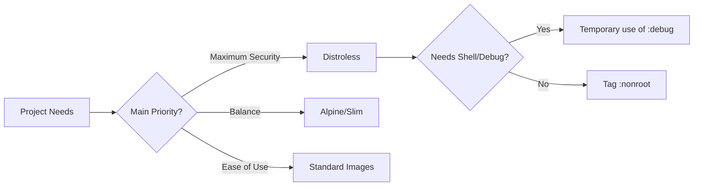

## Table of Contents

- [Table of Contents](#table-of-contents)
- [Introduction](#introduction)
- [What are Distroless Containers?](#what-are-distroless-containers)
- [Benefits](#benefits)
  - [1. Enhanced Security](#1-enhanced-security)
  - [2. Reduced Size](#2-reduced-size)
  - [3. Simplified Auditing](#3-simplified-auditing)
- [Implementation](#implementation)
  - [Multi-stage Builds](#multi-stage-builds)
  - [Supported Technologies](#supported-technologies)
  - [Practical Examples](#practical-examples)
    - [Node.js](#nodejs)
    - [Python](#python)
    - [Java](#java)
- [Best Practices](#best-practices)
  - [Security](#security)
  - [Performance](#performance)
  - [Maintenance](#maintenance)
- [2025 Considerations](#2025-considerations)
  - [Kubernetes Integration](#kubernetes-integration)
  - [Modern DevSecOps](#modern-devsecops)
  - [New Technologies](#new-technologies)
- [Limitations and Challenges](#limitations-and-challenges)
- [Alternatives](#alternatives)
- [References](#references)

## Introduction

Containers have revolutionized how we develop, package, and deploy applications. However, standard containers based on full Linux distributions often include unnecessary components for running applications, increasing the attack surface and image size. Distroless containers emerged as a solution to these problems.

## What are Distroless Containers?

Distroless containers are language-focused Docker images that contain only the application and its runtime dependencies, removing operating system components like package managers, shells, and other general-purpose tools.

Despite the name "distroless" (without distribution), these images are still based on Linux distributions (usually Debian), but with most components removed, keeping only what's essential to run the application.



The smallest distroless image, `gcr.io/distroless/static-debian12`, is approximately 2 MiB. That's about 50% of the size of Alpine (~5 MiB) and less than 2% of the size of a full Debian (124 MiB).


## Benefits

### 1. Enhanced Security

Reducing non-essential components significantly decreases the attack surface:

- **Fewer vulnerabilities**: Fewer installed packages means fewer components that might contain vulnerabilities.
- **No shell**: Most attacks depend on the existence of a shell inside the container.
- **Reduced permissions**: Options to run as a non-root user are included by default.

### 2. Reduced Size

Smaller images bring several benefits:

- **Faster deployment**: Less data to transfer between registries and hosts.
- **Less disk space**: Saves resources in environments with many containers.
- **Faster startup**: Less data to load into memory.

### 3. Simplified Auditing

With fewer components, it becomes easier to:

- **Track dependencies**: Clear visibility of the libraries used.
- **Verify security**: Fewer components to analyze for vulnerabilities.

## Implementation

### Multi-stage Builds

The recommended way to use distroless containers is through Docker multi-stage builds:

```dockerfile
# Build stage - using a complete image
FROM node:20 AS build
WORKDIR /app
COPY package*.json ./
RUN npm install --production
COPY . .

# Final stage - using distroless
FROM gcr.io/distroless/nodejs20-debian12
WORKDIR /app
COPY --from=build /app /app
# The ENTRYPOINT is already configured as "node"
CMD ["app.js"]
```

This two-stage process allows:

1. Building/preparing the application in a complete environment
2. Copying only the necessary artifacts to the final distroless image


### Supported Technologies

The Google Distroless project supports various languages/runtimes:

- **Node.js**: Versions 18, 20, and 22
- **Python**: Versions 3.9, 3.10, 3.11
- **Java**: Versions 11, 17, 21
- **Go**: Through the static image (for compiled binaries)
- **Base**: A minimal image with glibc, libssl, openssl, ca-certificates, and tzdata

Each image is available in several variants:

- `gcr.io/distroless/<technology>-debian<version>` (default)
- `gcr.io/distroless/<technology>-debian<version>:nonroot` (run as non-root user)
- `gcr.io/distroless/<technology>-debian<version>:debug` (includes shell for debugging)

### Practical Examples

#### Node.js

```dockerfile
# Build stage
FROM node:20 AS build
WORKDIR /app
COPY package*.json ./
RUN npm install --production
COPY . .

# Final stage
FROM gcr.io/distroless/nodejs20-debian12:nonroot
WORKDIR /app
COPY --from=build /app /app
EXPOSE 3000
CMD ["index.js"]
```

#### Python

```dockerfile
# Build stage
FROM python:3.11 AS build
WORKDIR /app
COPY requirements.txt .
RUN pip install --no-cache-dir -r requirements.txt
COPY . .

# Final stage
FROM gcr.io/distroless/python3-debian12:nonroot
WORKDIR /app
COPY --from=build /app /app
COPY --from=build /usr/local/lib/python3.11/site-packages /usr/local/lib/python3.11/site-packages
EXPOSE 5000
CMD ["app.py"]
```

#### Java

```dockerfile
# Build stage
FROM maven:3.9-eclipse-temurin-21 AS build
WORKDIR /app
COPY pom.xml .
COPY src ./src
RUN mvn package -DskipTests

# Final stage
FROM gcr.io/distroless/java21-debian12:nonroot
WORKDIR /app
COPY --from=build /app/target/*.jar /app/app.jar
EXPOSE 8080
CMD ["app.jar"]
```

## Best Practices

### Security

1. **Use the `:nonroot` tag**:

   ```dockerfile
   FROM gcr.io/distroless/nodejs20-debian12:nonroot
   ```

2. **Pin specific versions**:

   ```dockerfile
   # Better
   FROM gcr.io/distroless/nodejs20-debian12:nonroot
   # Avoid
   FROM gcr.io/distroless/nodejs:latest
   ```

3. **Use integrity verification**:

   ```bash
   # Verify image signatures with cosign
   cosign verify gcr.io/distroless/nodejs20-debian12
   ```

4. **Implement healthchecks via code**:
   Since there's no curl/wget in distroless images, implement healthchecks using the application language.

   For Node.js:

   ```javascript
   // healthcheck.js
   const http = require('http');

   const options = {
     host: 'localhost',
     port: process.env.PORT || 3000,
     path: '/health',
     timeout: 2000,
   };

   const request = http.get(options, (res) => {
     process.exit(res.statusCode === 200 ? 0 : 1);
   });

   request.on('error', (err) => {
     process.exit(1);
   });
   ```

   In Dockerfile:

   ```dockerfile
   HEALTHCHECK --interval=30s --timeout=3s --start-period=5s --retries=3 \
     CMD ["healthcheck.js"]
   ```

### Performance

1. **Optimize dependencies**:

   ```bash
   # For Node.js, remove development dependencies
   npm install --production
   # Or use yarn
   yarn install --production
   ```

2. **Minimize layers**:
   Combine RUN commands to reduce the number of layers in the image.

3. **Use `.dockerignore`**:
   Avoid copying unnecessary files to the image.
   ```
   node_modules
   .git
   .github
   tests
   docs
   ```

### Maintenance

1. **Use debug images when necessary**:

   ```bash
   # For temporary debugging
   FROM gcr.io/distroless/nodejs20-debian12:debug
   ```

2. **Automate security analysis**:

   ```bash
   # Example with Trivy
   trivy image gcr.io/your-project/your-app:latest
   ```

3. **Maintain documentation**:
   Document the process of building and maintaining distroless images.

## 2025 Considerations

### Kubernetes Integration

In 2025, Kubernetes has become even more central to container deployments. When using distroless containers with Kubernetes:

1. **Configure probes properly**:

   ```yaml
   livenessProbe:
     exec:
       command: ['node', 'healthcheck.js']
     initialDelaySeconds: 10
     periodSeconds: 30
   ```

2. **Use security policies**:
   ```yaml
   securityContext:
     runAsNonRoot: true
     readOnlyRootFilesystem: true
     allowPrivilegeEscalation: false
   ```

### Modern DevSecOps

1. **Continuous scanning**:
   Integrate tools like Trivy, Grype, or Snyk into the CI/CD pipeline to check for vulnerabilities in distroless images.

2. **Signing and verification**:
   Use Cosign/Sigstore to sign and verify images.

3. **Software Bill of Materials (SBOM)**:
   Generate and maintain SBOMs for your distroless images.

### New Technologies

1. **Chainguard Images**:
   An alternative to Google Distroless images, focusing on "wolfi-base".

2. **Jetpack.io Devbox**:
   Integration of development environments with distroless containers.

## Limitations and Challenges

1. **Complex debugging**:
   The absence of shell and diagnostic tools makes it difficult to debug problems in production.

2. **Learning curve**:
   Adoption requires advanced knowledge of Docker and containerization practices.

3. **Additional package configuration**:
   Adding extra packages to distroless images can be complicated.

4. **System dependencies**:
   Applications that heavily depend on system utilities may be incompatible.

## Alternatives

1. **Alpine Linux**:
   A lightweight alternative (~5 MiB) with a minimal shell and package manager.

2. **Slim variants**:
   Official images with the `-slim` suffix offer a balance between size and functionality.

3. **Chainguard Images**:
   Minimalist images focusing on compliance and security.

4. **Buildpacks**:
   An alternative approach to building images without explicit Dockerfiles.



## References

- [GoogleContainerTools/distroless - GitHub](https://github.com/GoogleContainerTools/distroless)
- [Dockerfiles for Node and TypeScript with Distroless - DEV Community](https://dev.to/andreasbergstrom/dockerfiles-for-nodejs-and-typescript-making-it-lean-mean-and-clean-3gld)
- [Distroless Containers - Contrast Security](https://docs.contrastsecurity.com/en/distroless-containers.html)
- [Dockerize a Node.js App using a Distroless Image - AlphaSec](https://alphasec.io/dockerize-a-node-js-app-using-a-distroless-image/)
- [Docker healthchecks in distroless Node.js - Matt Knight](https://www.mattknight.io/blog/docker-healthchecks-in-distroless-node-js)
- [What's Inside Distroless Container Images - iximiuz Labs](https://iximiuz.com/en/posts/containers-distroless-images/)
- [Choosing the best Node.js Docker image - Snyk](https://snyk.io/blog/choosing-the-best-node-js-docker-image/)
- [Why distroless containers aren't the security solution you think they are - Red Hat](https://www.redhat.com/en/blog/why-distroless-containers-arent-security-solution-you-think-they-are)
