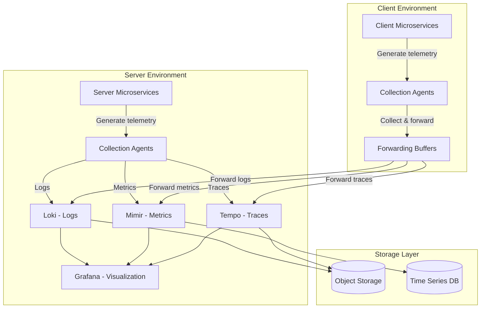
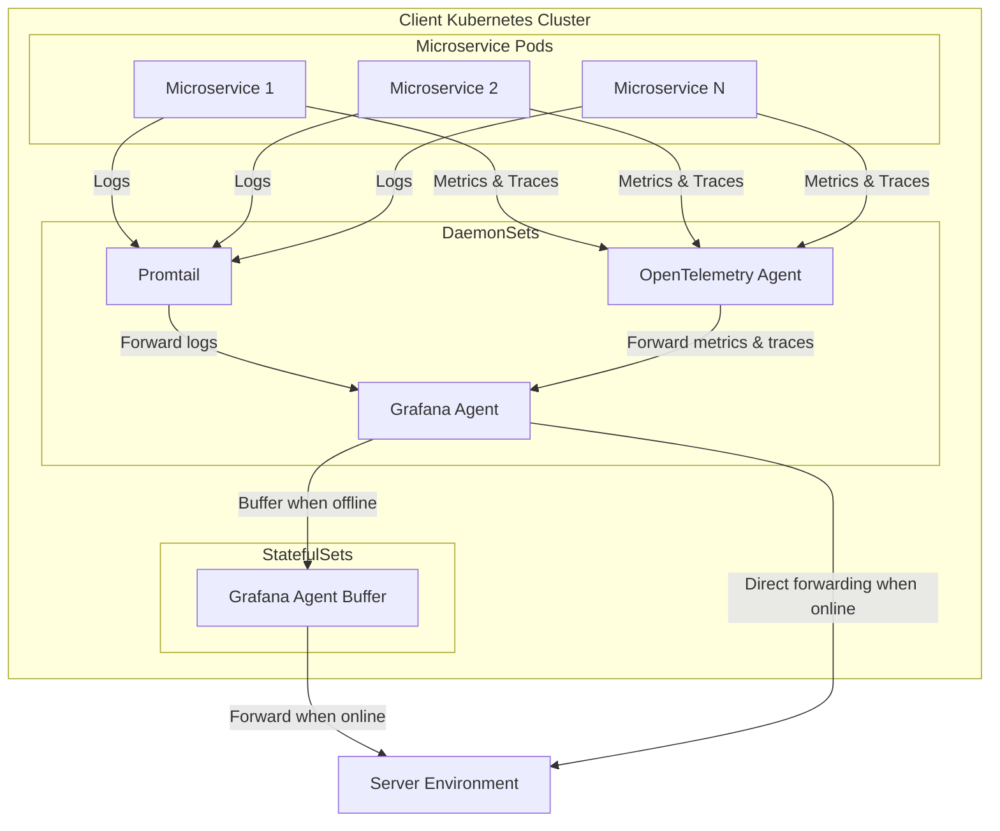
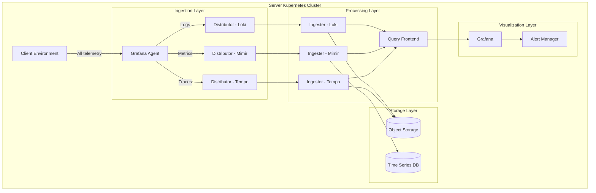

## Observability Solution Comparison for Distributed Microservices Architecture

### Executive Summary

This document provides a comprehensive comparison of modern observability solutions for a distributed microservices architecture deployed in Kubernetes. The architecture consists of containerized microservices split between client and server environments in different physical locations, with the following requirements:

- Collection of logs, metrics, and traces from all microservices
- No data persistence on the client side
- Visualization and persistence exclusively on the server side

We'll focus on the Grafana LGTM stack (Loki, Grafana, Tempo, Mimir) and compare it against other popular observability solutions, highlighting its advantages for this specific architecture.

### Table of Contents

1. [Observability Platform Comparison](#observability-platform-comparison)
2. [Grafana LGTM Stack Features](#grafana-lgtm-stack-features)
3. [Overall Architecture](#overall-architecture)
4. [Client-Side Architecture](#client-side-architecture)
5. [Server-Side Architecture](#server-side-architecture)
6. [Deployment Considerations](#deployment-considerations)
7. [Benchmarks](#benchmarks)
8. [Recommendations](#recommendations)

### Observability Platform Comparison

| Feature                    | Grafana LGTM                          | Elastic Stack                               | Prometheus + Jaeger                        | Datadog                      | New Relic                    |
| -------------------------- | ------------------------------------- | ------------------------------------------- | ------------------------------------------ | ---------------------------- | ---------------------------- |
| **Logs**                   | Loki (lightweight, index-free)        | Elasticsearch (resource-intensive indexing) | No native solution (requires ELK or Loki)  | Proprietary logs pipeline    | Proprietary logs pipeline    |
| **Metrics**                | Mimir (horizontally scalable)         | Elasticsearch/Metricbeat                    | Prometheus (less scalable than Mimir)      | Proprietary metrics pipeline | Proprietary metrics pipeline |
| **Traces**                 | Tempo (correlation with logs/metrics) | APM                                         | Jaeger (less integrated with metrics/logs) | Proprietary tracing          | Proprietary tracing          |
| **Visualization**          | Grafana (unified dashboards)          | Kibana (less flexible than Grafana)         | Grafana (would still be required)          | Proprietary dashboards       | Proprietary dashboards       |
| **Kubernetes Integration** | Native                                | Good                                        | Native                                     | Good                         | Good                         |
| **Multi-Tenant Support**   | Strong                                | Limited                                     | Limited                                    | Good                         | Good                         |
| **Resource Efficiency**    | High (especially Loki)                | Low (Elasticsearch is resource-intensive)   | Medium                                     | N/A (SaaS)                   | N/A (SaaS)                   |
| **Open Source**            | Yes                                   | Yes                                         | Yes                                        | No                           | No                           |
| **Self-hosted Option**     | Yes                                   | Yes                                         | Yes                                        | No                           | No                           |
| **Unified Query Language** | LogQL/PromQL-compatible               | Kibana Query Language                       | Multiple languages                         | Proprietary                  | Proprietary                  |
| **Exemplars Support**      | Yes                                   | Limited                                     | Limited                                    | Limited                      | Limited                      |
| **Cost**                   | Open source (deployment costs only)   | Open source (deployment costs only)         | Open source (deployment costs only)        | Subscription-based           | Subscription-based           |

### Grafana LGTM Stack Features

#### L - Loki (Logs)

Loki is a horizontally scalable log aggregation system designed to be very cost-effective and easy to operate. Unlike other logging systems, Loki:

- **Index-free architecture**: Only indexes metadata (labels) rather than full text, reducing storage requirements significantly
- **Uses object storage**: Works with S3, GCS, Azure Blob, or local filesystem
- **Native Kubernetes integration**: Easy deployment with Helm charts
- **LogQL query language**: Similar to PromQL, reducing the learning curve
- **Label-based**: Similar labeling approach to Prometheus, allowing correlation between logs and metrics

#### G - Grafana (Visualization)

Grafana provides visualization for all components of the LGTM stack:

- **Unified dashboards**: Single pane of glass for logs, metrics, and traces
- **Flexible visualization options**: Graphs, heatmaps, tables, etc.
- **Alert management**: Centralized alerting across all data sources
- **Correlation**: Native support for correlating metrics, logs, and traces
- **Multi-tenancy**: Strong support for multiple teams/projects
- **Plugin ecosystem**: Extensive collection of data source plugins and visualization options

#### T - Tempo (Traces)

Tempo is a distributed tracing backend specialized for Kubernetes environments:

- **Native OpenTelemetry support**: Works with the emerging standard for instrumentation
- **Trace-to-logs**: Direct linking from traces to relevant logs
- **Trace-to-metrics**: Direct linking from traces to relevant metrics
- **Highly scalable**: Uses object storage for traces
- **Cost-effective**: Minimal index, focuses on trace ID lookups
- **Native Kubernetes integration**: Easy deployment with Helm charts

#### M - Mimir (Metrics)

Mimir is Grafana's horizontally scalable, highly available, multi-tenant time-series database:

- **Drop-in replacement for Prometheus**: Full compatibility with PromQL
- **Unlimited cardinality**: Scales better than vanilla Prometheus
- **Long-term storage**: Designed for long-term metrics retention
- **Horizontal scalability**: Can scale to millions of series
- **Multi-tenancy**: Strong isolation between different teams/projects
- **High availability**: No single points of failure

### Overall Architecture

The architecture combines both client and server environments, with the client side focusing only on collection and forwarding of observability data, while the server handles storage, processing, and visualization.

### Client-Side Architecture

The client side has no persistence and is designed to be as lightweight as possible while ensuring reliable data transmission to the server.

#### Client Components:

1. **Collection Agents:**

   - **Promtail**: Deployed as a DaemonSet, collects logs from all pods using the Kubernetes log API
   - **OpenTelemetry Agent**: Collects metrics and traces from instrumented applications
   - **Grafana Agent**: Acts as a central collector and forwarder for all telemetry data

2. **Buffering Layer:**
   - **Grafana Agent Buffer**: Provides temporary storage when the server is unreachable
   - Configured with disk buffering to prevent data loss during network outages
   - Implements retry logic and exponential backoff for reliable delivery

### Server-Side Architecture

The server side handles all persistence, processing, and visualization of observability data.

#### Server Components:

1. **Ingestion Layer:**

   - **Grafana Agent**: Receives and processes incoming telemetry data
   - **Distributors**: Handle write path for each data type (logs, metrics, traces)
   - Implements rate limiting, authentication, and validation

2. **Processing Layer:**

   - **Ingesters**: Process and store data temporarily before committing to long-term storage
   - **Query Frontend**: Handles read path, optimizing queries and caching results

3. **Storage Layer:**

   - **Object Storage** (S3, GCS, Azure Blob): For logs (Loki) and traces (Tempo)
   - **Time Series Database**: For metrics (Mimir)

4. **Visualization Layer:**
   - **Grafana**: Provides dashboards, alerts, and exploration tools
   - **Alert Manager**: Handles alerting and notification routing

### Deployment Considerations

#### Resource Requirements

| Component           | CPU     | Memory | Storage               | Notes                   |
| ------------------- | ------- | ------ | --------------------- | ----------------------- |
| **Client Side**     |         |        |                       |                         |
| Promtail            | 100m    | 128Mi  | Temporary buffer      | Per node                |
| OpenTelemetry Agent | 200m    | 256Mi  | Temporary buffer      | Per node                |
| Grafana Agent       | 200m    | 512Mi  | 10-50Gi               | For buffering           |
| **Server Side**     |         |        |                       |                         |
| Loki Distributor    | 1 core  | 1Gi    | N/A                   | Per instance            |
| Loki Ingester       | 2 cores | 4Gi    | 100Gi                 | Per instance            |
| Mimir Distributor   | 1 core  | 1Gi    | N/A                   | Per instance            |
| Mimir Ingester      | 4 cores | 8Gi    | 100Gi                 | Per instance            |
| Tempo Distributor   | 1 core  | 1Gi    | N/A                   | Per instance            |
| Tempo Ingester      | 2 cores | 4Gi    | 50Gi                  | Per instance            |
| Grafana             | 1 core  | 2Gi    | 20Gi                  | Per instance            |
| Object Storage      | N/A     | N/A    | Scales with retention | Typically S3-compatible |

#### Network Considerations

- **Bandwidth**: Ensure sufficient bandwidth between client and server environments
- **Reliability**: Implement robust retry mechanisms for telemetry data
- **Security**: Use TLS for all communications between client and server
- **Firewall Rules**: Allow necessary ports for telemetry data flow

### Benchmarks

#### Performance Comparison

| Metric                        | Grafana LGTM                             | Elastic Stack                 | Prometheus + Jaeger                 |
| ----------------------------- | ---------------------------------------- | ----------------------------- | ----------------------------------- |
| **Log Ingestion Rate**        | 1M events/sec/node                       | 100K events/sec/node          | N/A (no native solution)            |
| **Log Query Performance**     | Sub-second for label queries             | Sub-second for indexed fields | N/A (no native solution)            |
| **Log Storage Efficiency**    | 10-20x more efficient than Elasticsearch | Baseline                      | N/A (no native solution)            |
| **Metrics Ingestion Rate**    | 1M samples/sec/node                      | 500K samples/sec/node         | 700K samples/sec/node               |
| **Metrics Query Performance** | ~100ms for 1M series                     | ~200ms for 1M series          | ~150ms for 1M series                |
| **Trace Ingestion Rate**      | 50K spans/sec/node                       | 30K spans/sec/node            | 40K spans/sec/node                  |
| **Client Resource Usage**     | Low (Grafana Agent)                      | Medium (Beats agents)         | Medium (Prometheus + OpenTelemetry) |
| **Server Resource Usage**     | Medium                                   | High                          | Medium-High                         |

#### Cost Efficiency

Assuming a medium-sized deployment (50 nodes, 500 microservices, 1TB logs/day, 1M active metrics, 100K traces/minute):

| Solution                  | Storage Costs/month | Compute Costs/month | Total Monthly Cost | Notes                                         |
| ------------------------- | ------------------- | ------------------- | ------------------ | --------------------------------------------- |
| Grafana LGTM              | $1,500              | $3,000              | $4,500             | Most efficient log storage                    |
| Elastic Stack             | $8,000              | $5,000              | $13,000            | Higher storage and compute due to indexing    |
| Prometheus + Jaeger + ELK | $6,000              | $4,000              | $10,000            | Multiple systems increase complexity and cost |
| Datadog                   | N/A                 | N/A                 | $25,000            | Based on host + ingestion pricing             |
| New Relic                 | N/A                 | N/A                 | $20,000            | Based on host + ingestion pricing             |

### Recommendations

Based on the requirements and benchmarks, the Grafana LGTM stack is the optimal choice for the described architecture for the following reasons:

1. **Unified Platform**: Single query language and visualization tool for all telemetry types
2. **Lightweight Client Footprint**: Grafana Agent is efficient and supports buffering for unreliable connections
3. **Cost Efficiency**: Particularly for logs with Loki's index-free architecture
4. **Kubernetes Native**: Designed for containerized environments
5. **Scalability**: Horizontally scalable at all layers
6. **Multi-tenancy**: Strong support for multiple teams/projects
7. **Open Source**: No vendor lock-in, community support

#### Implementation Plan

1. **Client Side**:

   - Deploy Grafana Agent as DaemonSet with buffer configuration
   - Instrument applications with OpenTelemetry for metrics and traces
   - Configure log collection via Promtail or direct Grafana Agent

2. **Server Side**:

   - Deploy Loki, Mimir, and Tempo using their respective Helm charts
   - Configure object storage for logs and traces
   - Set up Grafana dashboards for unified visibility
   - Implement alerting for critical services

3. **Monitoring the Monitoring**:
   - Set up meta-monitoring to ensure observability system health
   - Implement automatic scaling based on load

The Grafana LGTM stack provides the most efficient and integrated solution for the distributed architecture described, with particular advantages in the separation of client/server components and the requirement for no persistence on the client side.

### Architecture diagrams

---
