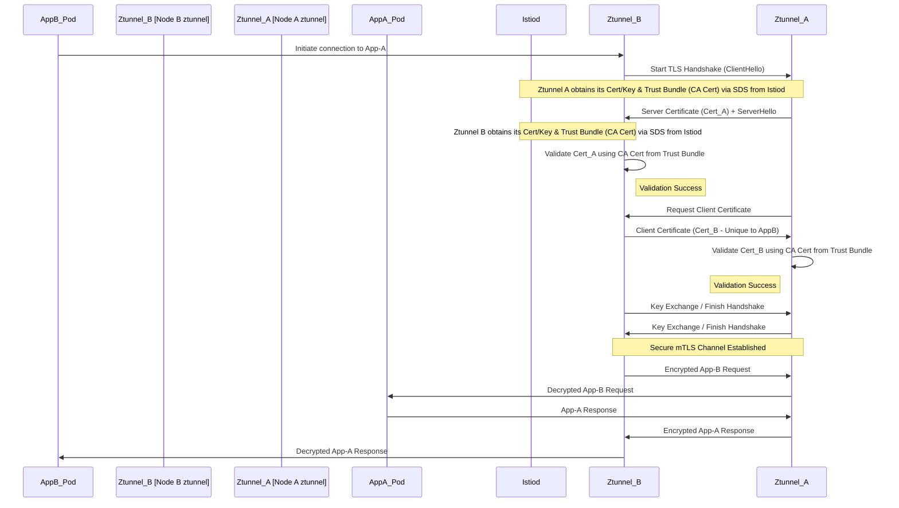
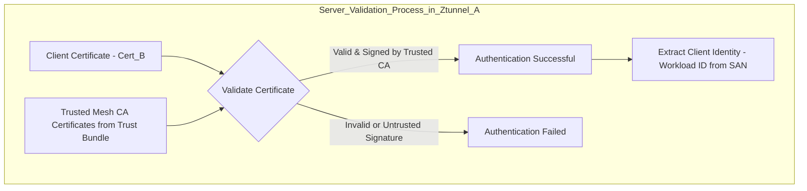
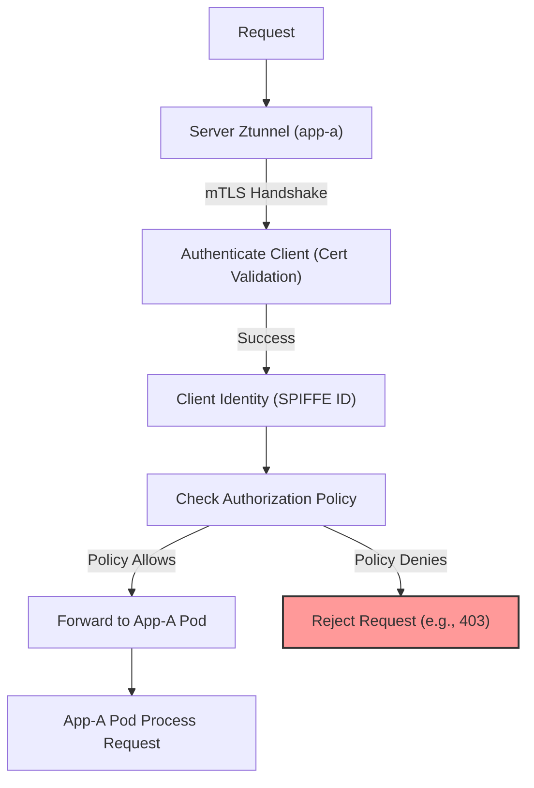

Mutual TLS (mTLS) in Istio Ambient Mesh: Handling Multiple Clients with Unique Certificates

## 1. Introduction

Securing communication between microservices is critical in modern distributed systems. Mutual TLS (mTLS) provides a robust solution by ensuring both parties in a connection authenticate each other using cryptographic certificates and that the communication channel is encrypted.

Istio, a popular service mesh, significantly simplifies the implementation and management of mTLS within Kubernetes. Istio's **Ambient Mesh** profile offers these security benefits without requiring sidecar proxies for every application pod, relying instead on node-level proxies (`ztunnel`) for foundational security features like mTLS.

This document explains how mTLS works within Istio Ambient Mesh, focusing on a common scenario: a single server application (`app-a`) receiving connections from multiple client applications (`app-b`, `app-c`, etc.), where each client possesses its own unique certificate. We will explore how the server validates these unique certificates and how Istio facilitates this process automatically.

## 2. Core Concepts Review

Before diving into the scenario, let's recap key concepts:

- **Mutual TLS (mTLS):** An extension of TLS where both the client and the server present X.509 certificates and cryptographically prove they possess the corresponding private keys. This establishes authenticated identities for both ends and encrypts the communication channel. It relies on a chain of trust rooted in one or more Certificate Authorities (CAs).
- **Istio Ambient Mesh:** A dataplane mode for Istio.
  - **`ztunnel`:** A node-level proxy (runs as a DaemonSet) responsible for L4 functions like mTLS, telemetry, and L4 authorization for pods on that node participating in the ambient mesh. It intercepts pod traffic transparently.
  - **Waypoint Proxy:** An optional, L7 Envoy proxy deployed per service account or namespace to handle L7 policies (HTTP routing, JWT authentication, L7 authorization, etc.). Not strictly required for basic mTLS.
- **Workload Identity (SPIFFE):** Istio assigns a strong, cryptographic identity to each workload (pod) based on its Kubernetes Service Account. This identity follows the SPIFFE (Secure Production Identity Framework for Everyone) standard, typically represented as a URI like `spiffe://<trust-domain>/ns/<namespace>/sa/<service-account>`. This identity is embedded within the workload's certificate.
- **Certificate Authority (CA):** A trusted entity responsible for issuing and signing digital certificates. In Istio, the control plane component `istiod` typically functions as the CA for the mesh, signing workload certificates. Alternatively, Istio can be integrated with an external or custom CA.
- **Secret Discovery Service (SDS):** The protocol used by Istio agents (`ztunnel`, Waypoint proxies, or sidecars) to securely request and receive certificates, private keys, and trust bundles (CA certificates) from `istiod` dynamically. This avoids storing sensitive private keys in static Kubernetes Secrets and enables automatic rotation.

## 3. Scenario Definition

- **Server:** `app-a`, running in a Kubernetes namespace managed by Istio Ambient Mesh.
- **Clients:** Multiple client applications, `app-b`, `app-c`, etc., potentially running in different namespaces, also managed by Istio Ambient Mesh.
- **Requirement:** Secure communication using mTLS between any client and the server.
- **Certificates:** Each workload (`app-a`, `app-b`, `app-c`) has its own unique X.509 certificate issued by the Istio mesh CA, embedding its unique SPIFFE identity.

**Goal:** Understand how `app-a`'s `ztunnel` validates incoming connections from `app-b`, `app-c`, etc., given they present different certificates.

## 4. The mTLS Handshake Flow in Ambient Mesh

Let's trace the steps when client `app-b` initiates a connection to server `app-a`. Remember that the `ztunnel` proxies on the respective nodes handle this transparently for the application containers.

1.  **Client Initiation:** `app-b` attempts to connect to `app-a` (e.g., `curl http://app-a.svc.cluster.local`). Traffic is intercepted by the `ztunnel` on `app-b`'s node.
2.  **TLS Handshake Start:** `app-b`'s `ztunnel` initiates a TLS handshake with `app-a`'s service address. The traffic is routed to the `ztunnel` on `app-a`'s node.
3.  **Server Certificate:** `app-a`'s `ztunnel` presents its unique certificate (containing `app-a`'s SPIFFE ID, signed by the mesh CA) to `app-b`'s `ztunnel`.
4.  **Server Validation by Client:** `app-b`'s `ztunnel` validates `app-a`'s certificate using its **trust bundle** (received from `istiod` via SDS, containing the mesh Root CA certificate). If the certificate is valid and signed by the trusted CA, validation succeeds.
5.  **Client Certificate Request:** `app-a`'s `ztunnel` requests `app-b`'s certificate (this is the "mutual" part).
6.  **Client Certificate:** `app-b`'s `ztunnel` presents its unique certificate (containing `app-b`'s SPIFFE ID, signed by the mesh CA).
7.  **Client Validation by Server:** `app-a`'s `ztunnel` validates `app-b`'s certificate using _its_ **trust bundle** (which also contains the mesh Root CA certificate).
    - **Is the certificate format valid and not expired?**
    - **Was it signed by the trusted Mesh CA?**
    - If yes to both, the client is authenticated.
8.  **Handshake Completion:** Keys are exchanged based on the handshake, and a secure, encrypted TLS channel is established between the two `ztunnel` instances.
9.  **Traffic Forwarding:** The original request from `app-b` is now sent over the secure channel and delivered to the `app-a` container by `app-a`'s `ztunnel`. Responses flow back similarly.



## 5. How the Server Handles Unique Client Certificates

The key takeaway is how `app-a`'s `ztunnel` handles Step 7 (Client Validation by Server) when faced with unique certificates from `app-b`, `app-c`, etc.

- **Focus on CA Trust, Not Individual Certificates:** The server (`app-a`'s `ztunnel`) **does not need a pre-configured list of every possible client certificate**. Its validation logic relies on its **Trust Bundle**, which contains the public certificate(s) of the Certificate Authority (or Authorities) it trusts. In the standard Istio setup, this is just the mesh CA's root certificate.
- **Validation Logic:** When `app-b` presents its unique certificate, `app-a`'s `ztunnel` checks:
  1.  Is the certificate itself valid (e.g., not expired)?
  2.  Is the signature on the certificate valid and verifiable using the public key of the **trusted mesh CA**?
- **Outcome:** If both checks pass, the certificate is considered authentic, regardless of whether the server proxy has seen this specific client certificate before. The trust is placed in the **CA** that issued the certificate. The same logic applies when `app-c` connects with its unique certificate.



- **Identity Extraction:** Upon successful validation, the server proxy securely extracts the client's verified identity (the SPIFFE ID) from the certificate's Subject Alternative Name (SAN) field. This identity is now known and trusted for the duration of the connection.

## 6. Authorization: The Next Step

Successfully authenticating the client via mTLS (proving _who_ it is) is only the first part of security. The next crucial step is **authorization** (deciding _what_ the authenticated client is allowed to do).

- **Using Authenticated Identity:** Istio uses the SPIFFE ID extracted during the mTLS handshake as the **source principal** for authorization decisions.
- **`AuthorizationPolicy`:** You define Istio `AuthorizationPolicy` resources to control access. These policies can specify rules based on various attributes, including the source principal.
- **Example Policies:**
  - Allow only `app-b` to access `/data` on `app-a`:
    ```yaml
    apiVersion: security.istio.io/v1
    kind: AuthorizationPolicy
    metadata:
      name: app-a-allow-app-b-only
      namespace: namespace-a # Namespace of the server app-a
    spec:
      selector:
        matchLabels:
          app: app-a # Apply to server app-a pods
      action: ALLOW
      rules:
        - from:
            - source:
                # Match specific identity of app-b
                principals: ['cluster.local/ns/namespace-b/sa/service-account-b']
          to:
            - operation:
                methods: ['GET']
                paths: ['/data']
    ```
  - Deny access from `app-c` entirely:
    ```yaml
    apiVersion: security.istio.io/v1
    kind: AuthorizationPolicy
    metadata:
      name: app-a-deny-app-c
      namespace: namespace-a
    spec:
      selector:
        matchLabels:
          app: app-a
      action: DENY
      rules:
        - from:
            - source:
                principals: ['cluster.local/ns/namespace-c/sa/service-account-c']
    ```



## 7. Role of Istio Ambient Mesh Components Summarized

- **`istiod`:**
  - Acts as the Mesh CA (by default or using plugged-in certs).
  - Issues unique identity certificates to workloads via SDS.
  - Distributes Trust Bundles (CA certs) to `ztunnels` via SDS.
  - Distributes `PeerAuthentication` and `AuthorizationPolicy` configurations to `ztunnels` (and Waypoints if applicable) via the xDS API.
- **`ztunnel`:**
  - Intercepts pod traffic.
  - Requests/receives certificates, keys, and trust bundles from `istiod` via SDS.
  - Performs the mTLS handshake (client and server side).
  - Validates peer certificates against the trusted CA bundle.
  - Extracts peer identity upon successful authentication.
  - Enforces `PeerAuthentication` policy (e.g., requires mTLS STRICT mode).
  - Enforces L4 `AuthorizationPolicy` rules (based on identity, IP, port).
- **Waypoint Proxy (Optional for this scenario):** If deployed for `app-a`, it would sit between `ztunnel` and the `app-a` pod to handle L7 policies. The mTLS connection between the client `ztunnel` and the Waypoint Proxy (acting on behalf of `app-a`) would still use the same CA trust and identity mechanisms.

## 8. Handling External CAs (Brief Mention)

If clients (`app-b`, `app-c`) were _external_ to the mesh and possessed certificates issued by entirely different, non-mesh CAs, the configuration becomes more complex. Typically, this scenario is handled at an Istio Ingress Gateway, which would need to be configured with a trust bundle containing the public certificates of all acceptable external CAs. Configuring `ztunnel` directly to trust multiple arbitrary external CAs for workload-to-workload mTLS is not a standard Istio pattern.

## 9. Benefits Summary

This Istio-managed mTLS approach provides:

- **Strong Authentication:** Cryptographically verifies the identity of both client and server.
- **Encryption:** Protects data in transit.
- **Automation:** Istio handles certificate issuance, distribution, and rotation automatically.
- **Decoupling:** Security is handled by the mesh infrastructure (`ztunnel`), not the application code.
- **Fine-grained Authorization:** Enables access control based on verified workload identities.
- **Zero-Trust Foundation:** Moves away from network perimeter security towards verifying every connection.

## 10. Conclusion

In Istio Ambient Mesh, a server (`app-a`) handles mTLS connections from multiple clients (`app-b`, `app-c`), each with a unique certificate, by **trusting the Certificate Authority (CA)** that signed those certificates. The server's `ztunnel` proxy validates the client's certificate against the mesh CA's public certificate (received via SDS). It doesn't need prior knowledge of every individual client certificate. Once authenticated, the unique identity embedded in the client's certificate (its SPIFFE ID) is used by Istio's `AuthorizationPolicy` mechanism to enforce fine-grained access control. This automated process provides robust, identity-based security for service-to-service communication within the Kubernetes cluster.
