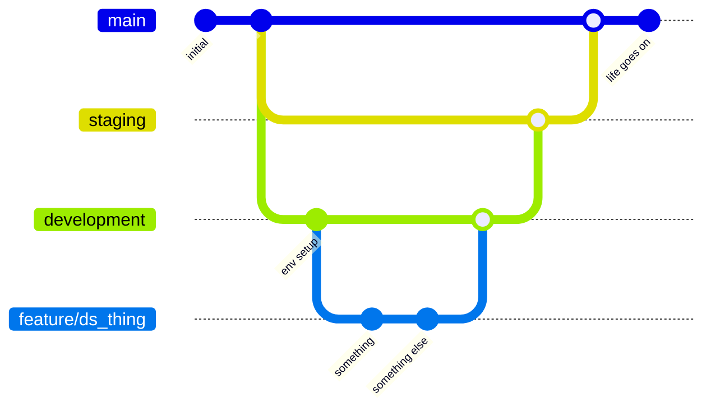
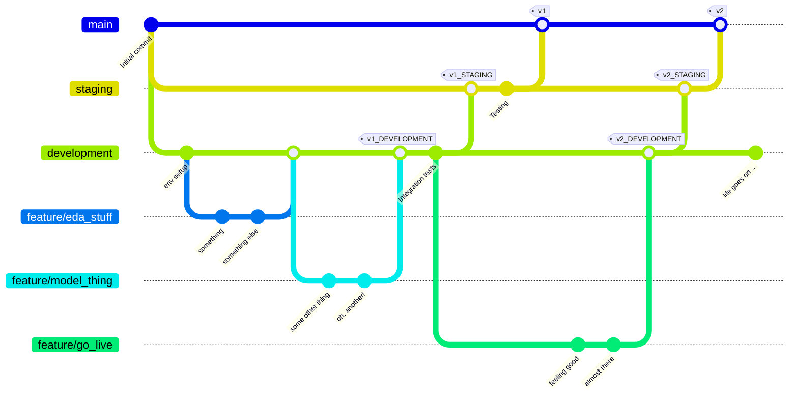

## Branching model

### Common Git branching strategies: GitFlow

```mermaid
---
config:
  logLevel: 'debug'
  theme: 'default'
  gitGraph:
    showBranches: true
---
gitGraph
    commit id: "initial"
    commit id: " "
    branch staging
    branch development
    checkout development
    commit id: "env setup"

    branch feature/ds_thing
    checkout feature/ds_thing
    commit id: "something"
    commit id: "something else"
    checkout development
    merge feature/ds_thing
    %% commit
    checkout staging
    merge development
    checkout main
    merge staging
    commit id: "life goes on"

```

### Example GitHub Actions with GitFlow

### Realistic Git branching strategy

```mermaid
---
config:
  logLevel: 'debug'
  theme: 'default'
  gitGraph:
    showBranches: true
---
gitGraph
    commit id: "Initial commit"
    branch staging
    branch development
    checkout development
    commit id: "env setup"

    branch feature/eda_stuff
    checkout feature/eda_stuff
    commit id: "something"
    commit id: "something else"
    checkout development
    merge feature/eda_stuff

    branch feature/model_thing
    checkout feature/model_thing
    commit id: "some other thing"
    commit id: "oh, another!"
    checkout development
    merge feature/model_thing tag: "v1_DEVELOPMENT"
    commit id: "Integration tests"

    checkout staging
    merge development tag: "v1_STAGING"
    commit id: "Testing"

    checkout main
    merge staging tag: "v1"

    checkout development
    branch feature/go_live
    checkout feature/go_live
    commit id: "feeling good"
    commit id: "almost there"
    checkout development
    merge feature/go_live tag: "v2_DEVELOPMENT"

    checkout staging
    merge development tag: "v2_STAGING"

    checkout main
    merge staging tag: "v2"

    checkout development
    commit id: "life goes on ..."
```
