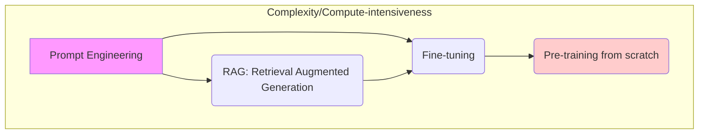

## LLMOps vs. MLOps

**LLMOps** (MLOps for LLMs) shares foundational MLOps principles: separation of environments, Git version control, MLflow, and the Lakehouse architecture remain essential.

However, LLMs introduce new requirements due to their size, general natural language input, reliance on external context, and difficulty in evaluation.

### Key Differences and Implications

| LLM Property               | Implication for MLOps/LLMOps                                                                                       |
| :------------------------- | :----------------------------------------------------------------------------------------------------------------- |
| **Generality/Variety**     | Development is incremental (starting from third-party/OSS models); requires support for fine-tuning/pre-training.  |
| **Natural Language Input** | **Prompt engineering** (designing text templates) becomes a critical part of development.                          |
| **Context Augmentation**   | Requires specialized tooling like **Vector Databases** for retrieval.                                              |
| **Very Large Size**        | Requires GPUs for serving; cost/performance trade-offs must be managed (quantization, smaller models).             |
| **Hard to Evaluate**       | Requires **Human Feedback** loops for testing and monitoring, and potentially using LLMs themselves as evaluators. |

## Strategies for Leveraging Custom Data

To tailor LLMs for specific domains, four primary methods exist, often used in combination:

### 1. Retrieval Augmented Generation (RAG)

RAG connects static LLMs to real-time, external knowledge, overcoming their training data cutoff limitation. It uses the LLM as a _reasoning engine_ augmented with current data.

- **Benefit:** Reduces hallucinations, provides domain-specific context, and is often more cost-effective and efficient than fine-tuning for frequent data updates.
- **Workflow:** User prompt -> Embedding Conversion (vector) -> **Information Retrieval** (from vector database) -> Context Augmentation (retrieved docs appended to prompt) -> Response Generation.
- **Vector Database:** Essential for efficient retrieval. Stores both vector embeddings and actual data, offers full CRUD operations, and allows advanced filtering, making them generally preferable to simpler vector libraries in production. **Databricks Vector Search** is used for semantic search.

### 2. Fine-tuning LLMs

Fine-tuning adapts a pre-trained LLM using a smaller, domain-specific dataset, adjusting a small number of weights.

- **When to Use:** When customization, specialization, or granular control over model behavior is needed (e.g., specialized task learning).
- **Key Distinction (RAG vs. Fine-tuning):** RAG reduces _development cost_ and provides dynamic context; Fine-tuning reduces _inference time and cost_ and achieves deeper specialization.
- **Practice:** Techniques like **Parameter-Efficient Fine-Tuning (PEFT)** (e.g., LoRA) conserve GPU memory while maintaining performance close to full fine-tuning. Human feedback is crucial here to refine outputs.

## LLM Packaging, Serving, and Cost Management

### LLM Packaging

The ML logic packaged for deployment may include lightweight API calls, "chains" (e.g., LangChain), LLM+tokenizer pipelines, or engineered prompts.

- **MLflow:** Used to package and version these artifacts. Prompts and LLM pipelines can be packaged as **MLflow models** (e.g., using `pyfunc` or `mlflow.langchain` flavor), allowing for version tracking (prompt versioning) just like model versions.

### LLM Inference and Serving

Databricks Model Serving is leveraged for both external API workflows and self-hosted OSS models.

- **Real-Time Inference:** Requires GPU instances.
  - **Third-Party API Workflow (RAG):** The Model Serving endpoint hosts the pre- and post-processing logic (e.g., the RAG chain) and calls the external LLM API (e.g., Azure OpenAI). The **MLflow AI Gateway** can standardize interactions, manage API keys, and enforce cost controls.
  - **Self-Hosted OSS Model:** The Model Serving endpoint hosts the LLM itself (e.g., a fine-tuned Hugging Face model), requiring GPU resources.
- **Batch Inference:** Suited for non-critical, non-immediate tasks. Spark can distribute inference across multiple machines (including GPUs).

### Cost/Performance Trade-Offs

Cost management is a major LLMOps concern due to the size of models.

| Method to Reduce Costs  | Description                                                                                                                     |
| :---------------------- | :------------------------------------------------------------------------------------------------------------------------------ |
| **Use a Smaller Model** | Try smaller model versions (e.g., Llama 2 13B vs 70B) or fine-tune a custom model (which can outperform a large generic model). |
| **Quantization**        | Reduce floating point precision (8-bit or 4-bit) to reduce GPU memory needs and computation, though quality may be affected.    |
| **Reduce Computation**  | Shorten queries and responses, or tweak inference configurations (e.g., avoiding expensive beam search).                        |
| **Split Traffic**       | Use cheaper models/methods for low ROI queries, reserving LLMs for high ROI traffic.                                            |

## LLM Evaluation

Evaluating LLMs is difficult because there is often no single "right" answer, outputs are sensitive to prompt variations, and traditional NLP metrics are insufficient.

- **Human Feedback:** Becomes essential, especially for user-facing applications (e.g., using "thumbs up/down" buttons or "chat with a human" options) to gather explicit or implicit feedback. This feedback is managed as data and informs monitoring.
- **LLMs as Evaluators:** Larger, more capable LLMs can be used as judges to assess the quality of outputs from smaller models, offering a faster and more cost-effective alternative to human labelers.

---

## Pictures and Diagrams

The following images (included in the source materials) represent key architectural and workflow concepts:

### MLOps Workflow and Tools (ML model lifecycle)

This diagram shows the core stages of an ML workflow, emphasizing the role of Unity Catalog (Data, Feature Store, Models) and MLflow (Tracking) throughout the process.

| Diagram Reference                                                               | Concept Illustrated                                                                                                                                                              |
| :------------------------------------------------------------------------------ | :------------------------------------------------------------------------------------------------------------------------------------------------------------------------------- |
|  | 1. Exploratory Data Analysis, 2. Feature Engineering, 3. Model Training, 4. Model Validation, 5. Deployment, 6. Monitoring, all governed by Version Control and MLflow Tracking. |

### Databricks MLOps Components

This diagram outlines the Databricks Lakehouse tools mapped to MLOps functionality:

| Component Category               | Databricks Tools                                 |
| :------------------------------- | :----------------------------------------------- |
| Orchestrator                     | Lakeflow Jobs                                    |
| Experiment Tracking              | MLflow                                           |
| Compute                          | Databricks compute                               |
| Glue                             | DABs (Databricks Asset Bundles)                  |
| Feature Engineering / Governance | Unity Catalog                                    |
| Model Registry                   | MLflow + Unity Catalog                           |
| Serving                          | Model Serving + Feature Serving                  |
| Monitoring                       | Lakehouse Monitoring, MLflow (LLM observability) |
| Vector Search                    | Vector Search                                    |

### MLOps Reference Architecture (E2E)

This complex diagram illustrates the recommended "deploy code" workflow across Development, Staging, and Production workspaces, detailing the interaction between Git branches, MLflow tracking servers, Unity Catalogs, and Model Serving endpoints.

| Diagram Reference                                          | Key Elements Illustrated                                                                                                                                                                                                                                                                          |
| :--------------------------------------------------------- | :------------------------------------------------------------------------------------------------------------------------------------------------------------------------------------------------------------------------------------------------------------------------------------------------ |
|  | Git branches (`dev`, `main`, `release`), CI/CD pipelines (Unit Tests, Integration Tests), three distinct MLflow Tracking Servers, three distinct Unity Catalogs (`dev`, `staging`, `prod`), and the flow of the Model Train-Deploy Workflow in production, utilizing Champion/Challenger aliases. |

---
