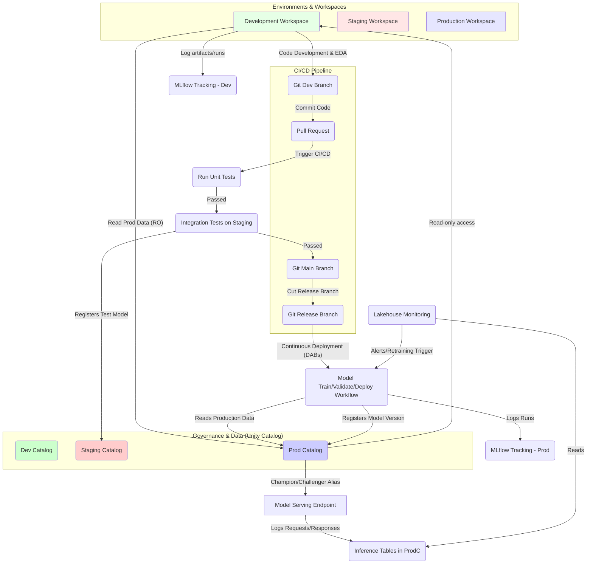

## Azure Databricks Architecture Clarity

It is critical to understand that **Azure Databricks runs ON Azure infrastructure**; it is not a replacement for Azure itself.

- **Azure:** The comprehensive cloud platform providing core services like Compute (VMs, containers), Storage (Blob, Data Lake), Networking, and Identity & Access Management. Azure is necessary for web apps, SQL databases, API management, and agent infrastructure (queues, caches).
- **Azure Databricks:** A specialized service (managed Apache Spark) focusing specifically on big data analytics, data engineering (ETL/ELT), and machine learning workflows. It utilizes Azure resources underneath.

## MLOps Reference Architecture on Databricks

The recommended MLOps architecture follows a **"deploy code" workflow**, assuming a multi-environment setup where Databricks workspaces map 1:1 to execution environments (Development, Staging, Production) and corresponding Unity Catalogs (dev, staging, prod).

### Architecture Diagram

The recommended architecture promotes code via Git/CI/CD, triggering automated training and deployment workflows in Production.

### Key Workflow Stages

1. **Development:** Data scientists interactively develop code (e.g., EDA). They train models, logging runs to the **dev MLflow Tracking server** and registering models to the **dev catalog**. Ideally, they have read-only access to the **prod catalog** for training data and comparing against the current production model.
2. **Staging (CI):** A Pull Request triggers the CI pipeline. This runs automated **unit tests** and then executes **integration tests** in the staging environment, mimicking production. If deployment involves real-time inference, Model Serving infrastructure should be created and tested in staging (e.g., load testing).
3. **Production (CD):** After merging to the main branch and cutting a release, the CD pipeline deploys the ML pipelines (using tools like **Databricks Asset Bundles**).
4. **Model Training/Validation/Deployment:** This is orchestrated by a multi-task **Databricks Workflow**.
   - _Training:_ Loads data from the prod catalog, logs runs to the prod MLflow Tracking server, and registers the model to the **prod catalog**.
   - _Validation:_ Loads the model, runs validation checks (e.g., performance thresholds, compliance), and if successful, assigns the **"Challenger" model alias** in Unity Catalog.
   - _Deployment:_ Compares the new "Challenger" model against the existing "Champion" model (either offline or via online methods like A/B testing/gradual rollout). The best-performing model version takes the **"Champion" alias**, and the Model Serving endpoint is updated with zero-downtime.
5. **Inference and Monitoring:**
   - _Inference:_ Batch, streaming, or Model Serving endpoints load the model using the **"Champion" alias**.
   - _Monitoring:_ Databricks Lakehouse Monitoring monitors the inference tables (requests/responses automatically logged by Model Serving). Alerts on data or model drift can trigger retraining workflows (Level 4 automation).

## Real-Time Model Serving on Azure Databricks

Databricks Model Serving simplifies the complex process of deploying real-time ML models.

### Packaging and Compute Best Practices

- **Packaging:** Models must be packaged using **MLflow flavors** (e.g., `mlflow.transformers`). For complex LLM logic (prompt templating, quantization, tokenization), a custom **MLflow `pyfunc` wrapper** is the best practice.
- **Compute:** **GPUs are non-negotiable** for low-latency LLM inference. Azure offers various GPU instances (NCasT4_v3-series, NC_A100_v4-series, etc.).
- **Production Deployment:** Use **Provisioned Throughput** for guaranteed low latency, ensuring GPU instances are _always hot_. Serverless is acceptable for non-critical, bursty workloads, but risks "cold starts".
- **Optimization:** Techniques like **4-bit or 8-bit quantization** drastically reduce GPU memory needs, allowing larger models on cheaper GPUs.

### Infrastructure as Code (IaC)

Do not deploy to production via the UI; use IaC. **Terraform with the Databricks Provider** is the superior tool for managing Databricks resources.

IaC manages:

1. **Azure Resources:** Resource Group, Databricks Workspace (with VNet Injection for security), Azure Key Vault (for secrets like Hugging Face tokens).
2. **Databricks Resources:** Secret scopes, and the core `databricks_model_serving` resource (defining endpoint, model, and compute).

### CI/CD for Model Serving

CI/CD pipelines (e.g., GitHub Actions or Azure DevOps) manage the rollout.

- **CI (Pull Request):** Lint/test code, run sanity inference tests, log the model to a _dev_ registry.
- **CD (Merge to Main/Tag):** Logs the model to the _production_ Unity Catalog registry. Triggers `terraform apply` to update the `databricks_model_serving` resource. **Canary deployment** (starting with 1% traffic to the new version) is the best practice for production.
