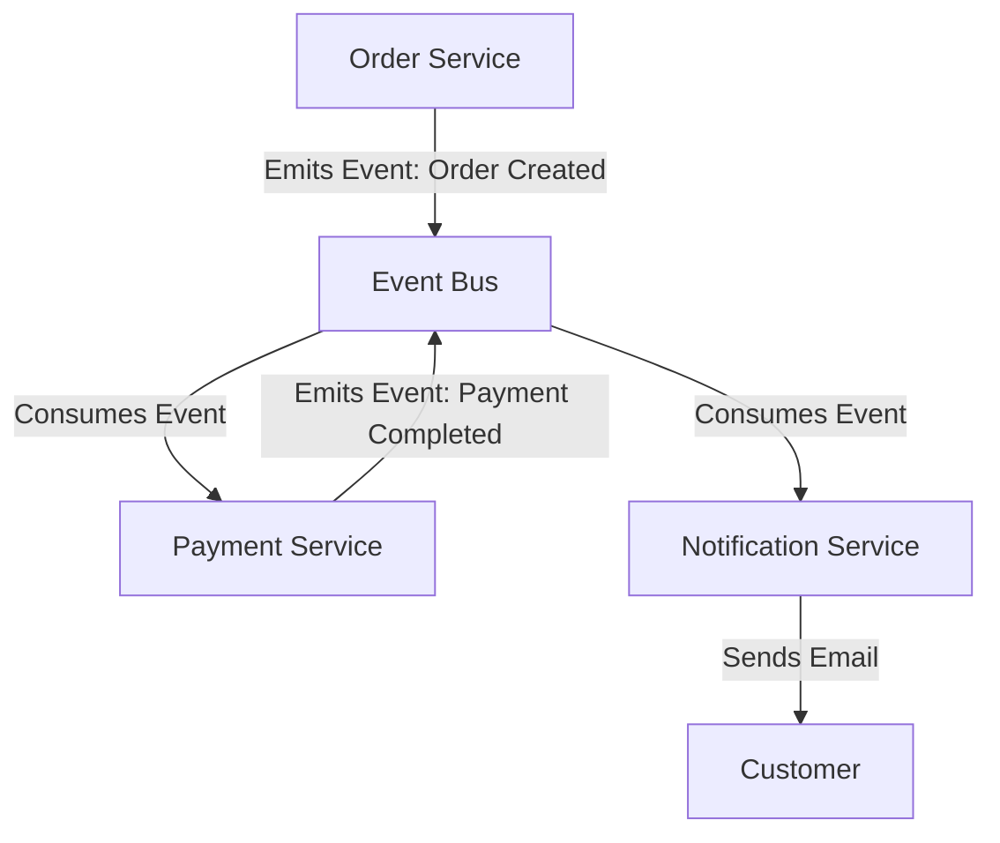
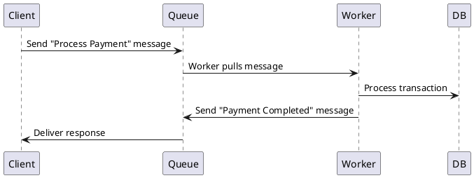

## Event-Driven Architecture vs. Message-Driven Architecture

### Introduction

In distributed systems, **Event-Driven Architecture (EDA)** and **Message-Driven Architecture (MDA)** are two fundamental paradigms for designing loosely coupled, scalable applications. While both rely on asynchronous communication, they differ in intent, patterns, and behavior.

This document provides a comprehensive comparison of **Event-Driven Architecture** and **Message-Driven Architecture**, including their definitions, use cases, pros and cons, and a guide to choosing the right one.

---

### 1️⃣ Event-Driven Architecture (EDA)

#### **Overview**

**Event-Driven Architecture** is a design pattern where components communicate by producing and consuming **events**. These events represent state changes, such as "User Registered" or "Order Placed." The system reacts to events asynchronously, allowing for high scalability and decoupling.

#### **How It Works**

1. **Producer (Event Emitter)**: Generates events (e.g., "Payment Processed").
2. **Event Bus/Broker**: Routes events to interested consumers (e.g., Apache Kafka, RabbitMQ, AWS EventBridge).
3. **Consumer (Event Listener)**: Reacts to the event (e.g., sends a confirmation email).

#### **Use Cases**

✅ Real-time applications (e.g., stock market, gaming, IoT)  
✅ Microservices with event-based communication  
✅ Event sourcing and CQRS (Command Query Responsibility Segregation)  
✅ Decoupling services in large-scale distributed systems

#### **Pros & Cons**

| Pros                              | Cons                                    |
| --------------------------------- | --------------------------------------- |
| High scalability & loose coupling | Harder to debug & trace events          |
| Asynchronous & reactive           | Eventual consistency issues             |
| Suitable for real-time systems    | Requires proper event schema management |

#### **Example**

---

### 2️⃣ Message-Driven Architecture (MDA)

#### **Overview**

**Message-Driven Architecture** is based on direct communication between components via **messages**. Unlike EDA, messages are **directed to specific recipients**, ensuring reliable delivery.

#### **How It Works**

1. **Producer (Message Sender)**: Sends a message to a queue (e.g., "Process Payment").
2. **Message Broker (Queue/Topic)**: Stores and forwards the message (e.g., RabbitMQ, ActiveMQ, Kafka).
3. **Consumer (Message Receiver)**: Reads the message and processes it (e.g., "Complete Payment").

#### **Use Cases**

✅ Asynchronous request-response communication  
✅ Reliable message delivery (e.g., banking, financial transactions)  
✅ Load balancing and task distribution  
✅ Legacy system integration

#### **Pros & Cons**

| Pros                                          | Cons                                      |
| --------------------------------------------- | ----------------------------------------- |
| Guaranteed message delivery                   | Higher coupling than event-driven systems |
| Supports synchronous & asynchronous workflows | Can become bottlenecked under high load   |
| Built-in message acknowledgment & retries     | Message queues can introduce latency      |

#### **Example**

---

### 3️⃣ Key Differences

| Feature               | Event-Driven Architecture (EDA) | Message-Driven Architecture (MDA)               |
| --------------------- | ------------------------------- | ----------------------------------------------- |
| **Communication**     | Publish-subscribe (fan-out)     | Point-to-point message queues                   |
| **Decoupling**        | High (loosely coupled services) | Medium (direct messages but still asynchronous) |
| **Message Direction** | Broadcast to multiple listeners | Directed to specific consumers                  |
| **Use Case**          | Real-time updates, streaming    | Task processing, reliable message delivery      |
| **Scalability**       | High                            | Medium (depends on queue scaling)               |
| **Complexity**        | High (tracing event flows)      | Moderate (requires queue management)            |

---

### 4️⃣ Choosing the Right Architecture

| When to Use                                      | Event-Driven Architecture (EDA) | Message-Driven Architecture (MDA) |
| ------------------------------------------------ | ------------------------------- | --------------------------------- |
| **You need real-time streaming**                 | ✅ Yes                          | ❌ No                             |
| **Loose coupling is a priority**                 | ✅ Yes                          | ❌ No                             |
| **Guaranteed message delivery**                  | ❌ No                           | ✅ Yes                            |
| **Complex workflows & distributed transactions** | ✅ Yes                          | ❌ No                             |
| **Synchronous processing required**              | ❌ No                           | ✅ Yes                            |
| **Resilient to service failures**                | ✅ Yes                          | ✅ Yes                            |

---

### 5️⃣ Conclusion

Both **Event-Driven** and **Message-Driven** architectures provide asynchronous communication but serve different needs.

- Use **Event-Driven Architecture** when **scalability, real-time updates, and decoupling** are the primary concerns.
- Use **Message-Driven Architecture** when **reliable message delivery, task processing, and point-to-point communication** are required.
