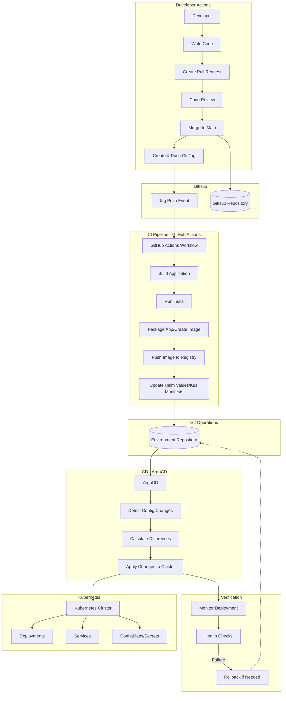

## Introduction

GitOps is a modern approach to managing infrastructure and application deployments using Git as the single source of truth. Let me explain what it is and the tools that can help implement it.

### What is GitOps?

GitOps is an operational framework that applies DevOps best practices for infrastructure automation to Git workflows. Key principles include:

1. **Declarative Infrastructure**: All infrastructure is defined as code and stored in Git
2. **Git as Single Source of Truth**: Git repositories contain the desired state of the system
3. **Automated Synchronization**: Changes to Git automatically update the infrastructure
4. **Observability & Verification**: Continuous monitoring ensures desired state matches actual state

### Recommended Tools for GitOps Implementation

The tools you mentioned form an excellent GitOps stack:

- **GitHub**: Repository hosting for storing your infrastructure and application manifests
- **GitHub Actions**: CI pipeline to test and validate changes
- **Kubernetes**: Container orchestration platform as the runtime environment
- **Helm**: Package manager for Kubernetes to manage complex application deployments
- **ArgoCD**: GitOps continuous delivery tool that automates deployments to Kubernetes

Let me create a diagram to illustrate the GitOps flow with these tools.

### GitOps Workflow Explanation

1. **Developer Workflow**:

   - Developers commit changes to application code, infrastructure definitions, or Helm charts in GitHub
   - Pull requests are created, reviewed, and merged following standard Git practices

2. **Continuous Integration with GitHub Actions**:

   - GitHub Actions automatically runs tests and validations on code changes
   - Container images are built and pushed to a container registry
   - Infrastructure manifests are validated for correctness

3. **Continuous Delivery with ArgoCD**:

   - ArgoCD monitors the Git repository for changes
   - When changes are detected, ArgoCD compares the desired state with the current state
   - ArgoCD automatically applies changes to synchronize the Kubernetes cluster

4. **Runtime Management**:

   - Kubernetes manages the deployed applications based on the manifests
   - Helm provides templating and package management for complex applications
   - Configuration is stored as Kubernetes ConfigMaps and Secrets

5. **Feedback and Observability**:
   - Monitoring systems detect drift between desired and actual state
   - ArgoCD can automatically remediate drift by resynchronizing

### Getting Started with GitOps

1. **Set up your Git repository structure**:

   ```
   repo/
   ├── apps/              # Application manifests
   │   ├── app1/
   │   │   └── deployment.yaml
   │   └── app2/
   │       └── deployment.yaml
   ├── infrastructure/    # Cluster infrastructure
   │   └── namespaces.yaml
   └── helm-charts/       # Helm charts for applications
       └── app1/
           └── templates/
   ```

2. **Install and configure ArgoCD in your Kubernetes cluster**
3. **Set up GitHub Actions workflows to validate and build**
4. **Connect ArgoCD to your Git repository**

### Tag-Based GitOps Workflow

This workflow demonstrates a GitOps approach where deployments are triggered only when a new git tag is pushed, providing more controlled releases.



Here's how it works:

#### 1. Developer Process

- Developers write code and create pull requests
- After code review, changes are merged to the main branch
- **For releases**, a git tag is created and pushed (e.g., `v1.2.3`)

#### 2. CI Pipeline Trigger

- GitHub Actions workflow is configured to trigger only on tag push events
- The workflow ignores regular commits to branches

#### 3. CI Process (GitHub Actions)

- Builds the application from the tagged commit
- Runs tests to verify functionality
- Creates a container image with the tag version
- Pushes the image to a container registry
- Updates deployment manifests with the new image tag

#### 4. Environment Repository Update

- CI pipeline updates Helm values or Kubernetes manifests in a separate environment repository
- This could be done through:
  - A direct commit to the environment repo
  - A pull request for human approval
  - Automated updates to environment-specific branches

#### 5. Continuous Delivery with ArgoCD

- ArgoCD monitors the environment repository
- When changes are detected in the manifests, ArgoCD:
  - Calculates differences between desired and current state
  - Applies the changes to the Kubernetes cluster
  - Monitors the deployment for success

#### 6. Verification and Safety

- Health checks verify the deployment was successful
- Automatic rollback can be triggered if deployments fail
- Metrics and logs are collected for observability

### Implementation Considerations

1. **Tag Naming Strategy**:

   - Semantic versioning (e.g., `v1.2.3`)
   - Environment-specific tags (e.g., `prod-v1.2.3`)

2. **Environment Repository Structure**:

   ```
   environments/
   ├── dev/
   │   └── values.yaml    # Points to :latest or branch images
   ├── staging/
   │   └── values.yaml    # Points to :main images
   └── production/
       └── values.yaml    # Points to versioned tags only
   ```

3. **GitHub Actions Workflow Configuration**:

   ```yaml
   on:
     push:
       tags:
         - 'v*' # Trigger only on version tags
   ```

4. **ArgoCD Configuration**:
   - Configure ArgoCD to sync automatically or manually depending on environment
   - Set up appropriate RBAC permissions for production environments

This tag-based approach gives you precise control over when deployments happen while maintaining all the benefits of GitOps principles.
