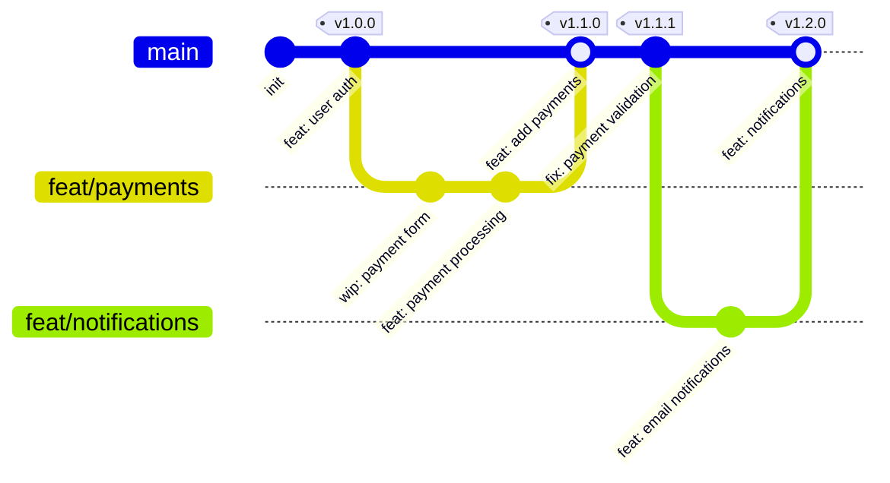
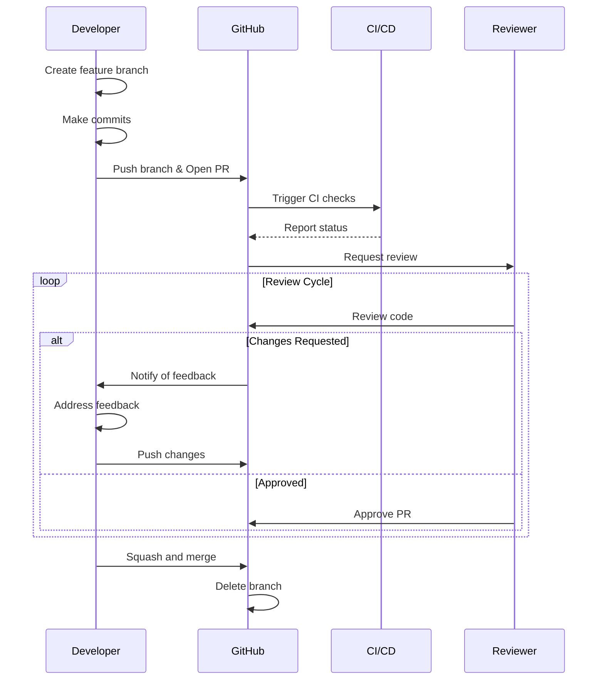
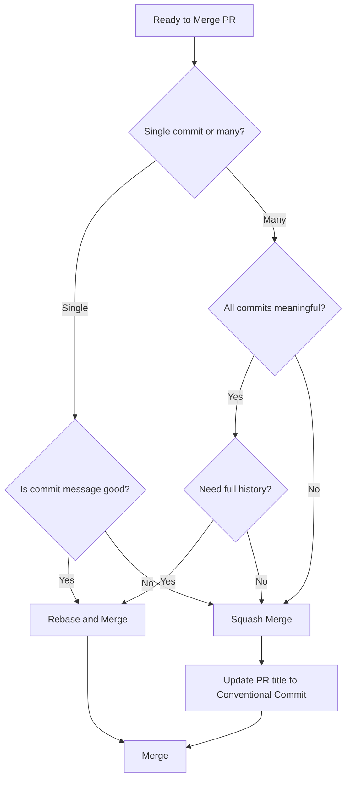

**Trunk-based development with Conventional Commits and automated semantic versioning represents the current industry standard** for high-performing engineering teams. This comprehensive reference covers modern Git workflows, AI coding agent configuration for Cursor and GitHub Copilot, and CI/CD best practices specifically optimized for a 2-person TypeScript team requiring pristine repository history.

The 2024-2025 DORA research confirms that teams with three or fewer active branches and daily merges to trunk consistently achieve elite software delivery performance. For your 2-developer team, trunk-based development eliminates merge conflicts, enables rapid code review cycles, and integrates seamlessly with automated semantic versioning through Conventional Commits.

---

## Trunk-based development is optimal for your team

Your 2-person team (1 senior + 1 junior) falls squarely within the parameters where trunk-based development excels. The strategy centers on a single shared branch (`main`) where all development happens, with **short-lived feature branches lasting hours to a maximum of 2 days**.

### Core implementation guidelines

All developers commit to `main` through short-lived feature branches. For teams under 15 people, direct commits to trunk are technically acceptable, but the PR workflow provides valuable code review gates. The critical constraint: **branches must be merged before they become stale**—ideally within the same working day.

Integration frequency should target **2-3 merges per day per developer**, with a hard minimum of once daily. DORA research shows teams with this cadence achieve 40% higher delivery performance. The trunk must always remain in a releasable state, which requires comprehensive automated testing before any merge.

**Feature flags become essential** for incomplete features that span multiple days. Boolean flags in code suffice initially, with tools like Unleash (open-source) or LaunchDarkly for complex requirements. Establish a cleanup cadence—flags should be removed within 2-4 weeks of feature stabilization.

### Branching strategy comparison

| Strategy | Best team size | Release cadence | Branch lifespan | CI/CD alignment |
|----------|---------------|-----------------|-----------------|-----------------|
| **Trunk-based** | Any (2-100+) | Continuous | Hours to 2 days | Excellent |
| GitHub Flow | 1-10 | Continuous | Days | Good |
| GitFlow | 10-50+ | Scheduled | Weeks-months | Poor |
| Release Flow | 10-1000+ | Sprint-based | Hours to 2 days | Excellent |

**GitFlow is explicitly discouraged**—its creator Vincent Driessen added a note stating teams doing continuous delivery should adopt simpler workflows. The complex branching creates merge conflicts, slows CI/CD, and adds process overhead without benefits for continuously deployed software.

### Daily workflow pattern

The senior developer should model good commit practices and perform synchronous code reviews when the junior is ready to merge. Each day follows this pattern:

1. **Morning**: Pull latest from `main`, create feature branch if needed
2. **Development**: Make small, focused changes with tests  
3. **Before breaks/end of day**: Merge to main via synchronous pair review
4. **End of day**: All work should be in main, feature branches deleted

For the junior developer, the initial target is branches that live no more than 1 day, with a stretch goal of hours. Request review immediately when ready—don't batch changes.

---

## Conventional Commits specification drives automated versioning

The Conventional Commits specification provides a structured format that enables automated changelog generation and semantic version determination. The full syntax:

```
<type>[optional scope]: <description>

[optional body]

[optional footer(s)]
```

### Standard commit types

| Type | Purpose | SemVer impact |
|------|---------|---------------|
| `feat` | New feature | MINOR bump |
| `fix` | Bug fix | PATCH bump |
| `docs` | Documentation only | No bump |
| `style` | Formatting, no logic change | No bump |
| `refactor` | Code restructure, no behavior change | No bump |
| `perf` | Performance improvement | PATCH bump |
| `test` | Adding/updating tests | No bump |
| `build` | Build system/dependencies | No bump |
| `ci` | CI/CD configuration | No bump |
| `chore` | Maintenance tasks | No bump |

**Breaking changes** use either the `!` notation after the type (`feat!:`) or a `BREAKING CHANGE:` footer. Both trigger a MAJOR version bump.

### Commit message best practices

Subject lines should use **imperative mood** ("Add feature" not "Added feature"), remain under **50 characters** (hard limit 72), and omit trailing periods. The body, separated by a blank line, explains "what" and "why" rather than "how," wrapped at 72 characters.

Example of a well-formed commit:

```
feat(auth): add password reset functionality

Implement password reset flow with email verification.
Users can now request a reset link valid for 24 hours.

Closes #234
Co-authored-by: Jane Doe <jane@example.com>
```

### Automated versioning with semantic-release

For TypeScript projects requiring full automation, **semantic-release** is the recommended tool. It analyzes commit messages, determines version bumps, generates changelogs, and publishes to npm—all without human intervention.

**`.releaserc.json` configuration:**

```json
{
  "branches": ["main"],
  "plugins": [
    "@semantic-release/commit-analyzer",
    "@semantic-release/release-notes-generator",
    "@semantic-release/changelog",
    "@semantic-release/npm",
    "@semantic-release/github",
    ["@semantic-release/git", {
      "assets": ["CHANGELOG.md", "package.json"],
      "message": "chore(release): ${nextRelease.version} [skip ci]"
    }]
  ]
}
```

For teams preferring release review control, **release-please** (Google) creates "Release PRs" that can be reviewed before merge. Both integrate with GitHub Actions and work excellently with Conventional Commits.

---

## Git configuration for Linux development

A properly configured Git installation eliminates friction and prevents common mistakes. This configuration represents current best practices from Git core developers and industry leaders.

### Essential global configuration

```ini
# ~/.gitconfig
[user]
    name = Your Name
    email = your.email@example.com
    signingkey = YOUR_GPG_KEY_ID

[core]
    editor = code --wait
    autocrlf = input
    excludesfile = ~/.gitignore

[init]
    defaultBranch = main

[pull]
    rebase = true

[push]
    autoSetupRemote = true
    followTags = true

[fetch]
    prune = true
    pruneTags = true

[merge]
    conflictstyle = zdiff3

[diff]
    algorithm = histogram
    colorMoved = plain

[rebase]
    autoSquash = true
    autoStash = true
    updateRefs = true

[rerere]
    enabled = true
    autoupdate = true

[commit]
    gpgsign = true
    verbose = true

[alias]
    st = status -sb
    lg = log --oneline --graph --all --decorate -16
    uncommit = reset --soft HEAD~1
    amend = commit --amend --no-edit
    cleanup = "!git branch --merged | grep -v '\\*\\|main' | xargs -n 1 git branch -d"
```

Key settings explained: `pull.rebase = true` prevents merge commits on pull, maintaining linear history. `rerere.enabled = true` remembers conflict resolutions, automatically applying them when the same conflicts recur. `merge.conflictstyle = zdiff3` (Git 2.35+) shows the base version in conflicts, making resolution clearer.

### SSH key setup with Ed25519

Ed25519 keys are recommended over RSA—they're shorter (68 vs 544 characters), faster, and more secure using modern elliptic curve cryptography.

```bash
# Generate Ed25519 key
ssh-keygen -t ed25519 -C "your.email@example.com"

# Start agent and add key
eval "$(ssh-agent -s)"
ssh-add ~/.ssh/id_ed25519

# Test connection
ssh -T git@github.com
```

Configure `~/.ssh/config` for multiple GitHub accounts:

```
Host github.com
    HostName github.com
    User git
    IdentityFile ~/.ssh/id_ed25519
    IdentitiesOnly yes
    AddKeysToAgent yes
```

### GPG commit signing setup

Signed commits verify authenticity and display the "Verified" badge on GitHub—important for public repositories.

```bash
# Generate GPG key
gpg --full-generate-key
# Select: RSA 4096 bits, 1 year expiry, your Git email

# Get key ID
gpg --list-secret-keys --keyid-format=long
# Output shows: sec rsa4096/3AA5C34371567BD2

# Configure Git
git config --global user.signingkey 3AA5C34371567BD2
git config --global commit.gpgsign true

# Export for GitHub (Settings > SSH and GPG Keys > New GPG Key)
gpg --armor --export 3AA5C34371567BD2
```

Add `export GPG_TTY=$(tty)` to `~/.bashrc` to prevent "inappropriate ioctl" errors.

### Husky setup for TypeScript projects

Git hooks enforce standards at commit time, preventing invalid commits from entering history.

```bash
# Install dependencies
npm install -D husky lint-staged @commitlint/cli @commitlint/config-conventional

# Initialize Husky
npx husky init
npm pkg set scripts.prepare="husky install"
```

**`.husky/pre-commit`:**
```bash
#!/bin/sh
. "$(dirname "$0")/_/husky.sh"
npx lint-staged
```

**`.husky/commit-msg`:**
```bash
#!/bin/sh
. "$(dirname "$0")/_/husky.sh"
npx --no -- commitlint --edit "$1"
```

**`package.json` lint-staged configuration:**
```json
{
  "lint-staged": {
    "**/*.{ts,tsx}": [
      "eslint --fix --max-warnings=0",
      "prettier --write"
    ]
  }
}
```

---

## Recovery patterns every senior engineer needs

### Undo operations reference

| Situation | Command | Effect |
|-----------|---------|--------|
| Undo last commit, keep staged | `git reset --soft HEAD~1` | Changes remain staged |
| Undo last commit, keep unstaged | `git reset HEAD~1` | Changes in working directory |
| Undo last commit completely | `git reset --hard HEAD~1` | **Discards all changes** |
| Amend last commit | `git commit --amend --no-edit` | Modifies most recent commit |
| Recover lost commit | `git reflog` then `git cherry-pick <sha>` | Restores from reflog |

### Interactive rebase for history cleanup

Before opening a PR, clean up WIP commits:

```bash
git rebase -i HEAD~5
# Change 'pick' to 'squash' for commits to combine
# Change 'pick' to 'reword' to edit messages
# Use 'fixup' to squash without keeping the message
```

**Critical rule**: Never rewrite history that has been pushed to shared branches. For pushed commits, use `git revert` to create a new commit that undoes changes safely.

### Recovering with reflog

The reflog tracks all HEAD movements for ~90 days:

```bash
git reflog
# e56ba1f HEAD@{0}: commit: Current work
# 9a9add8 HEAD@{2}: commit: The "lost" commit

# Recover by creating branch at that point
git branch recovered-work HEAD@{2}
```

---

## Cursor IDE agent configuration for Git workflows

Cursor's AI agents can be configured to follow your Git conventions through multiple mechanisms: Rules, Skills, and Commands.

### The modern approach: .mdc files and AGENTS.md

The legacy `.cursorrules` file is deprecated. Modern configuration uses **`.mdc` files** in `.cursor/rules/` or the cross-platform **AGENTS.md** standard (supported by Google, OpenAI, Factory, and Sourcegraph).

**`.cursor/rules/git-workflow.mdc`:**

```markdown
---
description: TypeScript project with trunk-based development and conventional commits
globs:
  - "**/*.ts"
  - "**/*.tsx"
alwaysApply: true
---

# Git Workflow - Trunk-Based Development

## Branch Strategy
- `main` is the single source of truth
- Create short-lived feature branches: `feat/<ticket>-<description>`
- Branches should be merged within 1-2 days
- Delete branches after merge

## Conventional Commits Format
All commits MUST follow this format:
```
<type>[optional scope]: <description>

[optional body]
[optional footer(s)]
```

### Types
- `feat`: New feature (MINOR version bump)
- `fix`: Bug fix (PATCH version bump)
- `docs`: Documentation only
- `refactor`: Code restructuring, no behavior change
- `test`: Adding/updating tests
- `chore`: Maintenance tasks

### Rules
- Subject line max 60 characters
- Use imperative mood ("add" not "added")
- Lowercase only, no period at end
- Body explains WHAT and WHY, not HOW

## Before Committing
1. Run `pnpm lint` - fix all errors
2. Run `pnpm typecheck` - ensure type safety
3. Run `pnpm test` - all tests must pass
4. Stage only related changes
```

### MCP integration for GitHub operations

The Model Context Protocol enables Cursor to interact with GitHub directly. The npm package `@modelcontextprotocol/server-github` was deprecated in April 2025—use the official Docker image.

**`~/.cursor/mcp.json`:**

```json
{
  "mcpServers": {
    "github": {
      "command": "docker",
      "args": [
        "run", "-i", "--rm",
        "-e", "GITHUB_PERSONAL_ACCESS_TOKEN",
        "ghcr.io/github/github-mcp-server"
      ],
      "env": {
        "GITHUB_PERSONAL_ACCESS_TOKEN": "YOUR_GITHUB_PAT"
      }
    }
  }
}
```

This enables automated PR creation, branch management, and issue operations through Agent Mode.

### Agent Mode vs Composer vs Ask

| Mode | Capabilities | Best for |
|------|--------------|----------|
| **Agent Mode** (⌘I) | Auto-context, terminal commands, file edits, MCP tools | Complex multi-file changes, PR creation |
| **Ask Mode** (⌘L) | Read-only, explanations | Learning, exploration |
| **Edit Mode** | Single-turn precise edits | Focused single-file changes |

Use Agent Mode for feature branch creation, multi-file refactoring with commits, and PR management through MCP.

---

## GitHub Copilot configuration for Git workflows

GitHub Copilot uses `.github/copilot-instructions.md` for repository-wide instructions, automatically attached to all chat requests.

### Complete copilot-instructions.md example

```markdown
# Project Custom Instructions

## About This Project
TypeScript monorepo using pnpm workspaces with trunk-based development.

## Code Standards

### TypeScript Guidelines
- Use TypeScript strict mode for all code
- Use `unknown` instead of `any` when type is uncertain
- Always add explicit return types to functions
- Use optional chaining (?.) and nullish coalescing (??)

### Naming Conventions
- PascalCase for types, interfaces, classes, components
- camelCase for variables, functions, methods
- SCREAMING_SNAKE_CASE for constants

## Build & Test Commands
- Build: `pnpm build`
- Test: `pnpm test`
- Lint: `pnpm lint`
- Type check: `pnpm typecheck`

## Git Workflow

### Branch Naming
- Feature: `feat/<description>`
- Bugfix: `fix/<description>`

### Commit Messages
Follow Conventional Commits:
- `feat:` new features
- `fix:` bug fixes
- `docs:` documentation
- `refactor:` code refactoring
- `chore:` maintenance tasks

Example: `feat(auth): add OAuth2 login support`

### Pull Requests
- Keep PRs small (target 50 lines, max 200)
- Use PR title as conventional commit message
- Request review from team member
```

### Agent Skills (December 2025 standard)

Agent Skills are folders containing instructions that Copilot automatically loads when relevant. Create in `.github/skills/`:

```markdown
---
name: git-workflow
description: Git workflow for trunk-based development with conventional commits
---

# Git Workflow Skill

## When to Use
Invoke when creating branches, writing commit messages, or preparing PRs.

## Branch Creation
1. Determine prefix (feat/fix/refactor/docs)
2. Create from current main: `git checkout -b <type>/<description>`
3. Verify clean working tree first

## Commit Generation
1. Analyze staged changes with `git diff --cached`
2. Identify primary change type
3. Generate conventional commit format
4. Include scope if changes are localized
```

### Copilot coding agent for automated tasks

The Copilot coding agent (which replaced Copilot Workspace in May 2025) handles Git operations autonomously:

1. Assign a GitHub issue to Copilot
2. Agent creates a branch prefixed with `copilot/`
3. Works in GitHub Actions-powered environment
4. Pushes commits and creates draft PR
5. Requests review when done

Security constraints: Can only push to branches it created, cannot push to main/master, CI workflows require human approval.

---

## GitHub Actions CI/CD for trunk-based TypeScript projects

### Complete CI workflow

```yaml
name: CI

on:
  push:
    branches: [main]
  pull_request:
    branches: [main]

permissions:
  contents: read
  pull-requests: write

jobs:
  lint:
    name: Lint & Type Check
    runs-on: ubuntu-latest
    steps:
      - uses: actions/checkout@v4

      - uses: pnpm/action-setup@v4
        with:
          version: 10

      - uses: actions/setup-node@v4
        with:
          node-version: '22'
          cache: 'pnpm'

      - run: pnpm install --frozen-lockfile
      - run: pnpm lint
      - run: pnpm tsc --noEmit

  test:
    name: Test
    runs-on: ubuntu-latest
    strategy:
      matrix:
        node-version: [20, 22]
    steps:
      - uses: actions/checkout@v4

      - uses: pnpm/action-setup@v4
        with:
          version: 10

      - uses: actions/setup-node@v4
        with:
          node-version: ${{ matrix.node-version }}
          cache: 'pnpm'

      - run: pnpm install --frozen-lockfile
      - run: pnpm test --coverage

  build:
    name: Build
    runs-on: ubuntu-latest
    needs: [lint, test]
    steps:
      - uses: actions/checkout@v4

      - uses: pnpm/action-setup@v4
        with:
          version: 10

      - uses: actions/setup-node@v4
        with:
          node-version: '22'
          cache: 'pnpm'

      - run: pnpm install --frozen-lockfile
      - run: pnpm build
```

### Release workflow with semantic-release

```yaml
name: Release

on:
  push:
    branches: [main]

permissions:
  contents: write
  issues: write
  pull-requests: write
  id-token: write

jobs:
  release:
    runs-on: ubuntu-latest
    steps:
      - uses: actions/checkout@v4
        with:
          fetch-depth: 0

      - uses: pnpm/action-setup@v4
        with:
          version: 10

      - uses: actions/setup-node@v4
        with:
          node-version: 'lts/*'
          cache: 'pnpm'

      - run: pnpm install --frozen-lockfile
      - run: pnpm build

      - name: Semantic Release
        env:
          GITHUB_TOKEN: ${{ secrets.GITHUB_TOKEN }}
        run: npx semantic-release
```

### Vitest vs Jest in 2025

**Vitest is recommended** for new TypeScript projects—it's 10x faster with native ESM support, zero-config with Vite, and native TypeScript support without ts-jest. Jest remains viable for mature codebases, but Vitest's performance and developer experience advantages are significant.

**vitest.config.ts:**

```typescript
import { defineConfig } from 'vitest/config';

export default defineConfig({
  test: {
    globals: true,
    reporters: process.env.GITHUB_ACTIONS
      ? ['default', 'github-actions']
      : ['default'],
    coverage: {
      provider: 'v8',
      reporter: ['text', 'json', 'json-summary'],
      thresholds: {
        lines: 80,
        functions: 80,
        branches: 80,
      },
    },
  },
});
```

### Branch protection configuration

For your 2-person team, configure these branch protection rules on `main`:

- **Require pull request before merging**: ✅ (enforces code review)
- **Required approvals**: 1 (sufficient for small team)
- **Dismiss stale approvals**: ✅ (ensures reviews are current)
- **Require status checks**: `lint`, `test (20)`, `test (22)`, `build`
- **Require branches up to date**: ✅ (prevents merge conflicts)
- **Require linear history**: ✅ (enables pristine history)
- **Do not allow bypassing**: ✅ (even admins follow rules)

### Dependabot auto-merge

**.github/dependabot.yml:**

```yaml
version: 2
updates:
  - package-ecosystem: "npm"
    directory: "/"
    schedule:
      interval: "weekly"
      day: "monday"
    groups:
      dependencies:
        patterns: ["*"]
        update-types: ["minor", "patch"]
    labels: ["dependencies", "automerge"]
```

Configure auto-merge workflow to approve and merge patch/minor updates automatically after CI passes.

---

## Pull request best practices for pristine history

### Optimal PR size backed by research

Graphite research demonstrates that **50-line PRs** are reviewed and merged 40% faster than 250-line changes, are 15% less likely to be reverted, and receive 40% more review comments per line. At 2,000+ lines, reviewers transition from "reading" to "skimming."

| Metric | Optimal | Maximum |
|--------|---------|---------|
| Lines changed | **50 lines** | 200-400 lines |
| Files | 1-5 | 10 |
| Review time | 15-30 minutes | 60 minutes |

### Merge strategy: Squash merge

For trunk-based development with pristine history, **squash merge is the clear choice**:

- Creates single, well-described commit per feature
- PR title becomes commit message (enable in GitHub settings)
- Linear history without merge commit noise
- Easy rollback of entire features
- Works perfectly with Conventional Commits

Configure in repository settings: Enable only "Squash merging," select "Default to PR title for squash merge commits."

### PR template for TypeScript projects

**`.github/PULL_REQUEST_TEMPLATE.md`:**

```markdown
## Description
<!-- What does this PR do? Why is this change needed? -->

## Related Issues
- Fixes #

## Type of Change
- [ ] 🐛 Bug fix
- [ ] ✨ New feature
- [ ] 💥 Breaking change
- [ ] 📚 Documentation

## Testing
- [ ] Unit tests pass (`pnpm test`)
- [ ] Type checking passes (`pnpm typecheck`)
- [ ] Linting passes (`pnpm lint`)

## Checklist
- [ ] Self-review completed
- [ ] Tests added/updated
- [ ] No TypeScript errors or `any` usage
```

### Code review for 2-person teams

**Primary mode: Synchronous review or pair programming** for complex features—instant feedback, no PR overhead. **Secondary mode: Prioritized async reviews** with <4 hour turnaround, reviewing pending PRs at start of each day.

**Self-merge is acceptable for**: Documentation-only changes, typo/formatting fixes, dependency updates (if CI passes), and pre-agreed trivial patterns.

---

## Mermaid diagrams for Git workflow visualization

### Trunk-based development gitgraph



### PR workflow sequence diagram



### Merge strategy decision flowchart



---

## Quick reference: File locations

| File | Location | Purpose |
|------|----------|---------|
| Cursor rules | `.cursor/rules/*.mdc` | Project AI instructions |
| AGENTS.md | Root or subfolders | Cross-platform AI instructions |
| Copilot instructions | `.github/copilot-instructions.md` | Repository-wide Copilot context |
| Copilot skills | `.github/skills/*/SKILL.md` | Task-specific Copilot capabilities |
| PR template | `.github/PULL_REQUEST_TEMPLATE.md` | PR description template |
| CI workflow | `.github/workflows/ci.yml` | Continuous integration |
| Release workflow | `.github/workflows/release.yml` | Automated versioning |
| Dependabot | `.github/dependabot.yml` | Dependency updates |
| MCP config | `~/.cursor/mcp.json` | Cursor MCP server configuration |

## Conclusion

**Trunk-based development with Conventional Commits and squash merge creates pristine, linear history** while enabling rapid iteration. The combination of automated semantic versioning, comprehensive CI/CD, and AI coding agents configured to follow these conventions transforms Git workflow from overhead into accelerant.

For your 2-person TypeScript team, the key implementation priorities are:

1. **Enable only squash merge** in GitHub repository settings with PR title as commit message
2. **Configure branch protection** requiring status checks, linear history, and 1 approval
3. **Set up semantic-release** for automated versioning based on Conventional Commits
4. **Install Husky + commitlint** to enforce commit conventions locally
5. **Configure Cursor rules and Copilot instructions** with your Git workflow standards
6. **Establish the daily cadence**: branches merged same day, synchronous reviews, 50-line PR targets

The research consistently shows that smaller commits, frequent integration, and automated tooling correlate with both higher quality and higher throughput. These practices don't slow teams down—they enable them to move faster with confidence.
