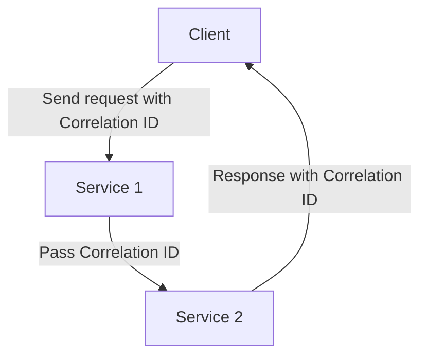
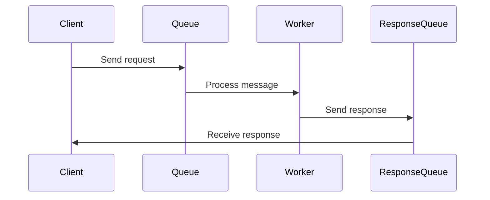
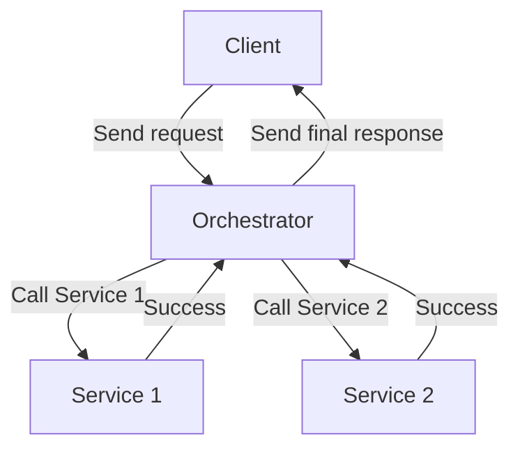
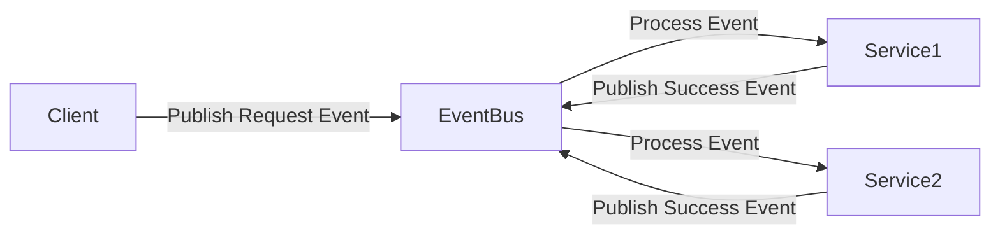

## How to Handle Responses in a Message-Driven Architecture

### Introduction

In a **Message-Driven Architecture**, handling responses effectively is crucial to ensuring a smooth and reliable flow of communication between services. Since messages are processed asynchronously, there needs to be a mechanism to determine when and how to send responses back to the client.

This document explores four common patterns for handling responses:

1. **Correlation Identifier**
2. **Request-Reply**
3. **Orchestration with a Central Coordinator**
   - Saga Orchestrator or Process Manager
4. **Choreography with Event Sourcing**

Each pattern has its own use cases, advantages, and drawbacks. Below is a detailed analysis of each pattern with examples and diagrams.

---

### 1. Correlation Identifier

#### **Overview**

The **Correlation Identifier** pattern ensures that asynchronous responses can be matched with the original request by attaching a unique identifier to each message. This identifier is passed through the system and used to correlate responses with requests.

#### **Use Cases**

- When multiple microservices process a request in parallel.
- When responses are expected at different times and need to be matched.
- When clients need to retrieve responses asynchronously.

#### **Pros & Cons**

| Pros                               | Cons                                                 |
| ---------------------------------- | ---------------------------------------------------- |
| Simple to implement                | Requires a persistent store for correlation tracking |
| Works well for parallel processing | Clients must track correlation IDs                   |
| Allows loose coupling              | No guaranteed response ordering                      |

#### **Example**

---

### 2. Request-Reply Pattern

#### **Overview**

The **Request-Reply** pattern provides a direct response mechanism where the client sends a request to a queue, and the service processes the request and sends a response back to a reply queue.

#### **Use Cases**

- When the client needs a synchronous response.
- When using **RPC over messaging** (e.g., RabbitMQ Request-Reply pattern).
- When a response is expected within a known timeframe.

#### **Pros & Cons**

| Pros                                         | Cons                                                  |
| -------------------------------------------- | ----------------------------------------------------- |
| Mimics traditional request-response behavior | Introduces tight coupling between sender and receiver |
| Easy to implement                            | Reduces system scalability                            |
| Works well for small systems                 | Requires handling of timeouts                         |

#### **Example**

---

### 3. Orchestration with a Central Coordinator

#### **Overview**

A **central orchestrator** (e.g., a Saga Orchestrator or Process Manager) coordinates multiple steps in a workflow, keeping track of which steps have completed and triggering the next step.

#### **Use Cases**

- When a request involves multiple services that must be coordinated.
- When failures require **compensating transactions**.
- When strict ordering is required.

#### **Pros & Cons**

| Pros                                     | Cons                                          |
| ---------------------------------------- | --------------------------------------------- |
| Centralized control simplifies debugging | Introduces a single point of failure          |
| Ensures ordered execution                | Can become a bottleneck in high-scale systems |
| Supports compensating transactions       | More complex to implement                     |

#### **Example**

---

### 4. Choreography with Event Sourcing

#### **Overview**

In a **choreographed event-driven system**, services listen to events and react accordingly. The system relies on an event log (e.g., Apache Kafka, EventStoreDB) to track the state of requests.

#### **Use Cases**

- When multiple services need to react independently to an event.
- When a **distributed log** of events needs to be maintained.
- When services should not be tightly coupled.

#### **Pros & Cons**

| Pros                                    | Cons                                               |
| --------------------------------------- | -------------------------------------------------- |
| Fully decoupled services                | Harder to debug due to lack of centralized control |
| High scalability                        | Eventual consistency can introduce delays          |
| Event logs provide history for auditing | Requires proper event schema versioning            |

#### **Example**

---

### Choosing the Right Pattern

| Pattern                                 | Best Use Cases                           | Complexity | Scalability |
| --------------------------------------- | ---------------------------------------- | ---------- | ----------- |
| **Correlation Identifier**              | Matching responses in async systems      | Medium     | High        |
| **Request-Reply**                       | Direct, synchronous responses            | Low        | Medium      |
| **Orchestrator (Saga/Process Manager)** | Coordinating workflows with dependencies | High       | Medium      |
| **Choreography with Event Sourcing**    | Event-driven, scalable systems           | High       | High        |

---

### Conclusion

Choosing the right **response-handling pattern** in a Message-Driven Architecture depends on **scalability, complexity, and coupling** requirements. For simple systems, **Request-Reply** may suffice. For highly scalable, decoupled systems, **Event Sourcing** is a better choice. When dealing with **multi-step transactions**, an **Orchestrator** provides better control.
