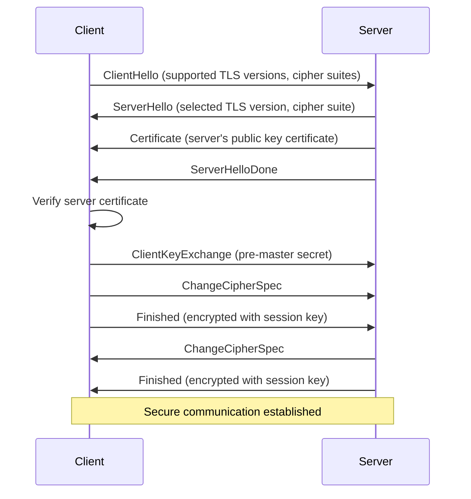
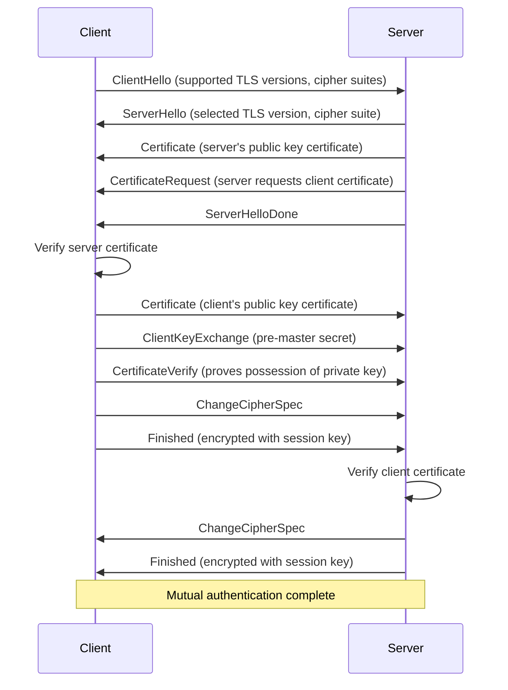
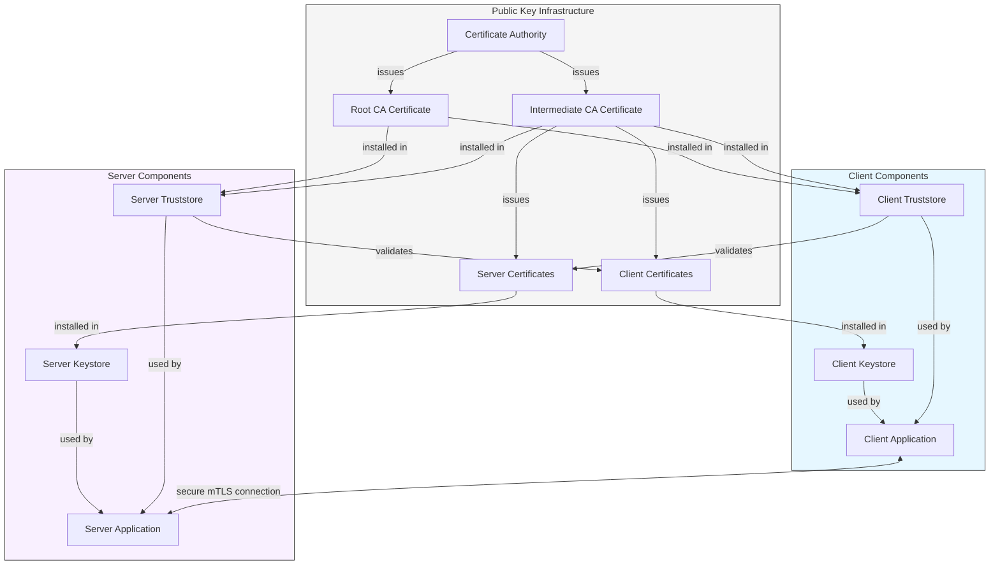
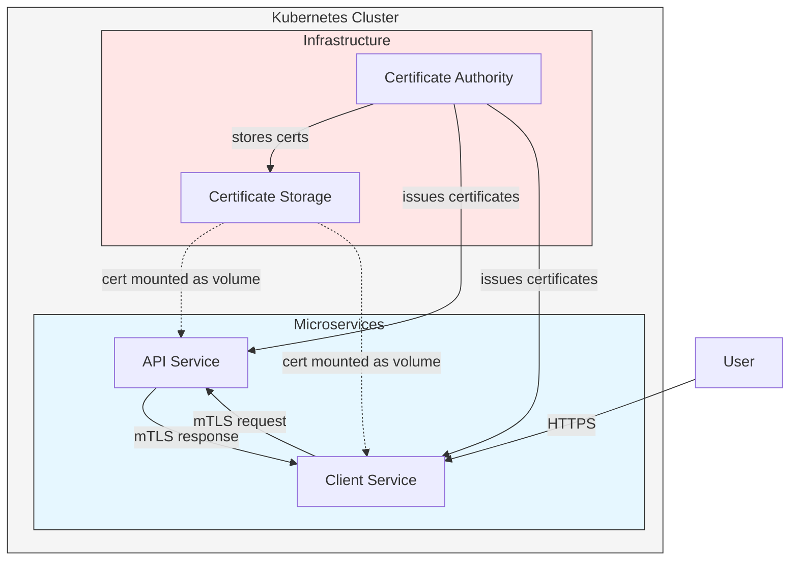
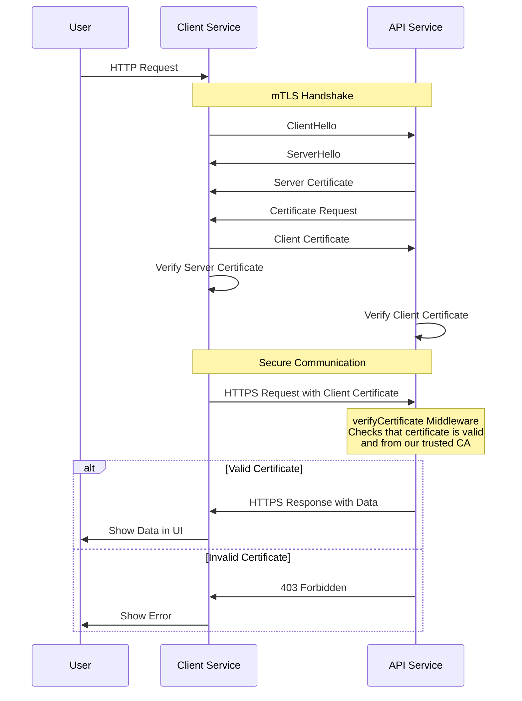
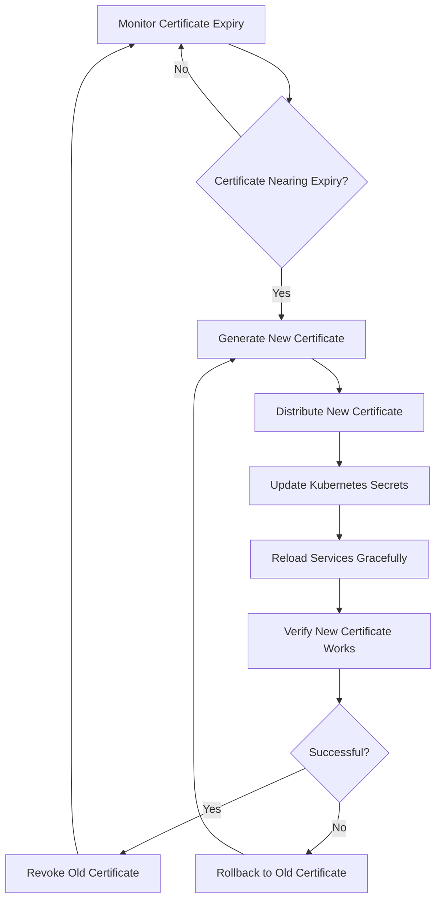
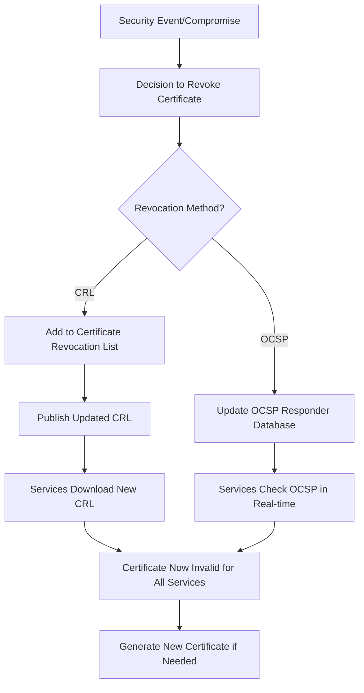

## Understanding TLS and Mutual TLS (mTLS)

I'll walk you through TLS, mutual TLS, and then help you build a practical microservices project to implement mTLS on Kubernetes using TypeScript.

### Transport Layer Security (TLS)

#### What is TLS?

TLS (Transport Layer Security) is a cryptographic protocol designed to provide secure communication over a computer network. It's the successor to SSL (Secure Sockets Layer) and is widely used to secure communications on the internet.

#### Key Concepts of TLS

1. **Encryption**: TLS encrypts data exchanged between parties to prevent eavesdropping
2. **Authentication**: TLS authenticates at least one party (typically the server) in the communication
3. **Integrity**: TLS ensures data hasn't been tampered with during transmission

#### How TLS Works



In a standard TLS handshake:

1. The client and server exchange hello messages to agree on protocols and cipher suites
2. The server sends its certificate (containing its public key)
3. The client verifies the server's certificate
4. The client and server establish session keys
5. Secure communication begins

#### Standard TLS Security Model

In standard TLS, only the server is authenticated. The client knows it's talking to the correct server, but the server doesn't verify the client's identity. This is suitable for many public-facing services like websites, where the server doesn't need to know who the client is.

### Mutual TLS (mTLS)

#### What is mTLS?

Mutual TLS extends standard TLS by requiring both the client and server to authenticate each other with certificates. This creates a two-way trust relationship.



#### What Problem Does mTLS Solve?

mTLS solves several security challenges:

1. **Unauthorized Service Access**: Prevents unauthorized clients from accessing services
2. **Service Impersonation**: Prevents attackers from impersonating legitimate services
3. **Man-in-the-Middle Attacks**: Makes MITM attacks more difficult by requiring both parties to possess valid certificates
4. **API and Service Security**: Provides strong authentication for APIs and service-to-service communication

#### Use Cases for mTLS

1. **Microservices Security**: Securing communication between microservices within a system
2. **Zero Trust Networks**: Implementing a zero-trust security model where nothing is trusted by default
3. **API Authentication**: Securing APIs from unauthorized access
4. **IoT Device Authentication**: Ensuring IoT devices are legitimate before allowing communication
5. **Financial Services**: Securing sensitive financial transactions between institutions

#### Pros and Cons of mTLS

###### Pros

1. **Strong Authentication**: Both parties are authenticated with cryptographic certificates
2. **Reduced Attack Surface**: Unauthorized access attempts are blocked at the TLS layer
3. **Scalable Security**: Can be implemented consistently across all services
4. **Complementary Security**: Works alongside other security measures like JWT tokens

###### Cons

1. **Certificate Management Complexity**: Managing, distributing, and rotating certificates can be challenging
2. **Performance Overhead**: The additional certificate verification adds some processing overhead
3. **Implementation Complexity**: More complex to set up and maintain than standard TLS
4. **Debugging Challenges**: Certificate issues can be difficult to troubleshoot

#### Main Components of mTLS



###### Key components include:

1. **Certificate Authority (CA)**

   - Issues and signs certificates
   - Can be public (like Let's Encrypt) or private (internal CA)

2. **Certificates**

   - Server certificates: Identify servers
   - Client certificates: Identify clients
   - Root and intermediate certificates: Establish chain of trust

3. **Trust Stores**

   - Collections of trusted CA certificates
   - Used to validate certificates presented by the other party

4. **Key Stores**
   - Store private keys and their associated certificates
   - Used to present identity during handshake

#### Certificate Management in mTLS

Certificate management is one of the most challenging aspects of mTLS:

1. **Certificate Issuance**: Process of creating and signing certificates
2. **Certificate Distribution**: Securely delivering certificates to services
3. **Certificate Rotation**: Regularly replacing certificates before expiration
4. **Certificate Revocation**: Invalidating compromised certificates

### Building a Practical mTLS Project

Now let's build a practical project to demonstrate mTLS with TypeScript microservices on Kubernetes.

#### Project Overview

We'll create a simple system with:

1. A backend API service that provides data
2. A frontend client service that consumes the API
3. A Certificate Authority service for managing our certificates

All services will communicate securely using mTLS.



#### Step 1: Set Up Project Structure

Let's start by setting up our project structure:

```
mtls-demo/
├── certs/                  # Certificate generation scripts
│   ├── ca/                 # CA certificates
│   ├── api-service/        # API service certificates
│   ├── client-service/     # Client service certificates
│   └── generate-certs.sh   # Certificate generation script
├── k8s/                    # Kubernetes manifests
│   ├── ca-deployment.yaml
│   ├── api-deployment.yaml
│   ├── client-deployment.yaml
│   └── secrets.yaml
├── services/
│   ├── api-service/        # Backend API service
│   │   ├── src/
│   │   ├── Dockerfile
│   │   └── package.json
│   └── client-service/     # Frontend client service
│       ├── src/
│       ├── Dockerfile
│       └── package.json
└── README.md
```

#### Step 2: Certificate Generation

First, let's create a script to generate our CA and service certificates:

```sh
#!/bin/bash
set -e

# Create directories for certificates
mkdir -p certs/{ca,api-service,client-service}

# Generate CA key and certificate
echo "Generating CA certificates..."
openssl genrsa -out certs/ca/ca.key 4096
openssl req -new -x509 -key certs/ca/ca.key -sha256 -subj "/CN=mtls-demo-ca" \
  -out certs/ca/ca.crt -days 365

# Function to generate service certificates
generate_service_cert() {
  SERVICE_NAME=$1
  SERVICE_DNS=$2

  echo "Generating certificates for $SERVICE_NAME..."

  # Generate service key
  openssl genrsa -out certs/$SERVICE_NAME/$SERVICE_NAME.key 2048

  # Generate service CSR (Certificate Signing Request)
  openssl req -new -key certs/$SERVICE_NAME/$SERVICE_NAME.key \
    -out certs/$SERVICE_NAME/$SERVICE_NAME.csr \
    -subj "/CN=$SERVICE_DNS"

  # Create config for SAN (Subject Alternative Name)
  cat > certs/$SERVICE_NAME/openssl.cnf <<EOF
[req]
req_extensions = v3_req
distinguished_name = req_distinguished_name

[req_distinguished_name]

[v3_req]
subjectAltName = @alt_names

[alt_names]
DNS.1 = $SERVICE_DNS
DNS.2 = $SERVICE_NAME
DNS.3 = $SERVICE_NAME.default
DNS.4 = $SERVICE_NAME.default.svc.cluster.local
EOF

  # Sign the CSR with our CA
  openssl x509 -req -in certs/$SERVICE_NAME/$SERVICE_NAME.csr \
    -CA certs/ca/ca.crt \
    -CAkey certs/ca/ca.key \
    -CAcreateserial \
    -out certs/$SERVICE_NAME/$SERVICE_NAME.crt \
    -days 365 \
    -sha256 \
    -extfile certs/$SERVICE_NAME/openssl.cnf \
    -extensions v3_req

  # Verify the certificate
  openssl verify -CAfile certs/ca/ca.crt certs/$SERVICE_NAME/$SERVICE_NAME.crt

  # Create PEM files (combined cert and key) for services that need it
  cat certs/$SERVICE_NAME/$SERVICE_NAME.crt certs/$SERVICE_NAME/$SERVICE_NAME.key > certs/$SERVICE_NAME/$SERVICE_NAME.pem

  echo "Certificates for $SERVICE_NAME generated successfully"
}

# Generate certificates for services
generate_service_cert "api-service" "api-service.default.svc.cluster.local"
generate_service_cert "client-service" "client-service.default.svc.cluster.local"

echo "All certificates generated successfully"
```

#### Step 3: Creating the API Service

Now let's build the API service in TypeScript:

```json title='package.json'
{
  "name": "api-service",
  "version": "1.0.0",
  "description": "API service with mTLS support",
  "main": "dist/index.js",
  "scripts": {
    "build": "tsc",
    "start": "node dist/index.js",
    "dev": "ts-node-dev src/index.ts"
  },
  "dependencies": {
    "express": "^4.18.2",
    "fs": "0.0.1-security",
    "https": "^1.0.0",
    "path": "^0.12.7"
  },
  "devDependencies": {
    "@types/express": "^4.17.17",
    "@types/node": "^20.2.5",
    "ts-node-dev": "^2.0.0",
    "typescript": "^5.1.3"
  }
}
```

```typescript title='src/index.ts'
import express from 'express';
import https from 'https';
import fs from 'fs';
import path from 'path';

// Create Express app
const app = express();
const PORT = process.env.PORT || 3000;

// Middleware to verify client certificate is from our CA
const verifyCertificate = (
  req: express.Request,
  res: express.Response,
  next: express.NextFunction,
) => {
  const cert = req.socket.getPeerCertificate();

  if (!cert || Object.keys(cert).length === 0) {
    console.error('No client certificate provided');
    return res.status(403).json({ error: 'Client certificate required' });
  }

  if (!req.client.authorized) {
    console.error('Client certificate not authorized');
    return res.status(403).json({ error: 'Invalid client certificate' });
  }

  console.log(`Client authenticated: ${cert.subject?.CN}`);
  next();
};

// Apply certificate verification middleware
app.use(verifyCertificate);

// JSON middleware
app.use(express.json());

// Basic API routes
app.get('/api/health', (req, res) => {
  res.json({ status: 'healthy' });
});

app.get('/api/data', (req, res) => {
  res.json({
    message: 'This data is secured with mTLS!',
    timestamp: new Date().toISOString(),
    clientCert: req.socket.getPeerCertificate().subject,
  });
});

// HTTPS server options with mTLS configuration
const httpsOptions = {
  key: fs.readFileSync(path.join(process.env.CERT_PATH || '/certs', 'api-service.key')),
  cert: fs.readFileSync(path.join(process.env.CERT_PATH || '/certs', 'api-service.crt')),
  ca: fs.readFileSync(path.join(process.env.CERT_PATH || '/certs', 'ca.crt')),
  requestCert: true, // Request client certificate
  rejectUnauthorized: true, // Reject requests without valid client certificate
};

// Create HTTPS server
const server = https.createServer(httpsOptions, app);

// Start server
server.listen(PORT, () => {
  console.log(`API Service running securely on port ${PORT}`);
  console.log(`TLS certificate loaded for: ${httpsOptions.cert}`);
  console.log(`Using CA certificate: ${httpsOptions.ca}`);
});
```

```dockerfile title='Dockerfile'
FROM node:18-alpine

WORKDIR /app

# Copy package files and install dependencies
COPY package*.json ./
RUN npm install

# Copy source code
COPY tsconfig.json ./
COPY src ./src

# Build TypeScript
RUN npm run build

# Create directory for certificates
RUN mkdir -p /certs

# Set environment variables
ENV NODE_ENV=production
ENV PORT=4000
ENV CERT_PATH=/certs
ENV API_SERVICE_URL=https://api-service:3000

# Expose client service port
EXPOSE 4000

CMD ["node", "dist/index.js"]
```

#### Step 4: Creating the Client Service

Now let's create the client service that will communicate with the API service:

```json title='package.json'
{
  "name": "client-service",
  "version": "1.0.0",
  "description": "Client service that connects to API using mTLS",
  "main": "dist/index.js",
  "scripts": {
    "build": "tsc",
    "start": "node dist/index.js",
    "dev": "ts-node-dev src/index.ts"
  },
  "dependencies": {
    "axios": "^1.4.0",
    "express": "^4.18.2",
    "fs": "0.0.1-security",
    "https": "^1.0.0",
    "path": "^0.12.7"
  },
  "devDependencies": {
    "@types/express": "^4.17.17",
    "@types/node": "^20.2.5",
    "ts-node-dev": "^2.0.0",
    "typescript": "^5.1.3"
  }
}
```

#### Step 5: Kubernetes Deployment

Now let's create the Kubernetes manifests to deploy our services:

###### Kubernetes Certificate Secrets

```yaml
# k8s/secrets.yaml
apiVersion: v1
kind: Secret
metadata:
  name: ca-cert
type: Opaque
data:
  # These values will need to be replaced with base64-encoded certificates
  # Use: cat certs/ca/ca.crt | base64 | tr -d '\n'
  ca.crt: '${CA_CERT}'
---
apiVersion: v1
kind: Secret
metadata:
  name: api-service-certs
type: Opaque
data:
  # These values will need to be replaced with base64-encoded certificates
  api-service.crt: '${API_SERVICE_CERT}'
  api-service.key: '${API_SERVICE_KEY}'
---
apiVersion: v1
kind: Secret
metadata:
  name: client-service-certs
type: Opaque
data:
  # These values will need to be replaced with base64-encoded certificates
  client-service.crt: '${CLIENT_SERVICE_CERT}'
  client-service.key: '${CLIENT_SERVICE_KEY}'
```

###### API Service Kubernetes Deployment

```yaml
# k8s/api-deployment.yaml
apiVersion: apps/v1
kind: Deployment
metadata:
  name: api-service
  labels:
    app: api-service
spec:
  replicas: 1
  selector:
    matchLabels:
      app: api-service
  template:
    metadata:
      labels:
        app: api-service
    spec:
      containers:
        - name: api-service
          image: mtls-demo/api-service:latest
          imagePullPolicy: IfNotPresent
          ports:
            - containerPort: 3000
          volumeMounts:
            - name: api-certs
              mountPath: /certs/api-service.crt
              subPath: api-service.crt
            - name: api-certs
              mountPath: /certs/api-service.key
              subPath: api-service.key
            - name: ca-cert
              mountPath: /certs/ca.crt
              subPath: ca.crt
          readinessProbe:
            httpGet:
              path: /api/health
              port: 3000
              scheme: HTTPS
            initialDelaySeconds: 5
            periodSeconds: 10
          livenessProbe:
            httpGet:
              path: /api/health
              port: 3000
              scheme: HTTPS
            initialDelaySeconds: 15
            periodSeconds: 20
      volumes:
        - name: api-certs
          secret:
            secretName: api-service-certs
        - name: ca-cert
          secret:
            secretName: ca-cert
---
apiVersion: v1
kind: Service
metadata:
  name: api-service
spec:
  selector:
    app: api-service
  ports:
    - port: 3000
      targetPort: 3000
  type: ClusterIP
```

###### Client Service Kubernetes Deployment

```yaml
# k8s/client-deployment.yaml
apiVersion: apps/v1
kind: Deployment
metadata:
  name: client-service
  labels:
    app: client-service
spec:
  replicas: 1
  selector:
    matchLabels:
      app: client-service
  template:
    metadata:
      labels:
        app: client-service
    spec:
      containers:
        - name: client-service
          image: mtls-demo/client-service:latest
          imagePullPolicy: IfNotPresent
          ports:
            - containerPort: 4000
          env:
            - name: API_SERVICE_URL
              value: 'https://api-service:3000'
          volumeMounts:
            - name: client-certs
              mountPath: /certs/client-service.crt
              subPath: client-service.crt
            - name: client-certs
              mountPath: /certs/client-service.key
              subPath: client-service.key
            - name: ca-cert
              mountPath: /certs/ca.crt
              subPath: ca.crt
          readinessProbe:
            httpGet:
              path: /health
              port: 4000
            initialDelaySeconds: 5
            periodSeconds: 10
          livenessProbe:
            httpGet:
              path: /health
              port: 4000
            initialDelaySeconds: 15
            periodSeconds: 20
      volumes:
        - name: client-certs
          secret:
            secretName: client-service-certs
        - name: ca-cert
          secret:
            secretName: ca-cert
---
apiVersion: v1
kind: Service
metadata:
  name: client-service
spec:
  selector:
    app: client-service
  ports:
    - port: 80
      targetPort: 4000
  type: LoadBalancer
```

#### Step 6: Setting Up the Project

Now let's create a script to build and deploy our services:

```sh title='setup.sh'
#!/bin/bash
set -e

# Make script executable with: chmod +x setup.sh

echo "=== mTLS Demo Project Setup ==="

# Step 1: Generate certificates
echo "Generating certificates..."
./certs/generate-certs.sh

# Step 2: Build Docker images
echo "Building Docker images..."

# Build API service
echo "Building API service..."
cd services/api-service
docker build -t mtls-demo/api-service:latest .
cd ../..

# Build Client service
echo "Building Client service..."
cd services/client-service
docker build -t mtls-demo/client-service:latest .
cd ../..

# Step 3: Create Kubernetes secrets with certificates
echo "Creating Kubernetes secrets..."

# Base64 encode certificates for Kubernetes secrets
CA_CERT=$(cat certs/ca/ca.crt | base64 | tr -d '\n')
API_SERVICE_CERT=$(cat certs/api-service/api-service.crt | base64 | tr -d '\n')
API_SERVICE_KEY=$(cat certs/api-service/api-service.key | base64 | tr -d '\n')
CLIENT_SERVICE_CERT=$(cat certs/client-service/client-service.crt | base64 | tr -d '\n')
CLIENT_SERVICE_KEY=$(cat certs/client-service/client-service.key | base64 | tr -d '\n')

# Create temp file with actual secrets
cat k8s/secrets.yaml | \
  sed "s/\${CA_CERT}/$CA_CERT/g" | \
  sed "s/\${API_SERVICE_CERT}/$API_SERVICE_CERT/g" | \
  sed "s/\${API_SERVICE_KEY}/$API_SERVICE_KEY/g" | \
  sed "s/\${CLIENT_SERVICE_CERT}/$CLIENT_SERVICE_CERT/g" | \
  sed "s/\${CLIENT_SERVICE_KEY}/$CLIENT_SERVICE_KEY/g" \
  > k8s/secrets_filled.yaml

# Apply secrets to Kubernetes
kubectl apply -f k8s/secrets_filled.yaml
rm k8s/secrets_filled.yaml  # Remove file with sensitive data

# Step 4: Deploy services to Kubernetes
echo "Deploying services to Kubernetes..."
kubectl apply -f k8s/api-deployment.yaml
kubectl apply -f k8s/client-deployment.yaml

echo "Waiting for services to be ready..."
kubectl wait --for=condition=ready pod -l app=api-service --timeout=60s
kubectl wait --for=condition=ready pod -l app=client-service --timeout=60s

# Step 5: Get access URL
echo "Getting service URL..."
if [ "$(uname)" == "Darwin" ]; then
  # MacOS
  open http://localhost:80
else
  # Linux
  echo "Access the client service at http://localhost:80"
fi

echo "=== Setup complete! ==="
echo "You can now access the client service in your browser."
```

#### Step 7: TypeScript Configuration

Let's add the TypeScript configuration file for our services:

```json title='tsconfig.json'
{
  "compilerOptions": {
    "target": "ES2020",
    "module": "commonjs",
    "lib": ["ES2020"],
    "outDir": "./dist",
    "rootDir": "./src",
    "strict": true,
    "esModuleInterop": true,
    "skipLibCheck": true,
    "forceConsistentCasingInFileNames": true,
    "resolveJsonModule": true
  },
  "include": ["src/**/*"],
  "exclude": ["node_modules", "dist"]
}
```

#### Step 8: Project README

Finally, let's create a README file with project information and instructions.

### How mTLS Works in Our Project

Let's walk through how mTLS is implemented in our project:



### Key Components in Our Implementation

1. **Certificate Authority (CA)**

   - We create a self-signed CA in `generate-certs.sh`
   - Both services trust this CA

2. **Service Certificates**

   - Each service gets its own unique certificate signed by our CA
   - Includes proper Subject Alternative Names (SANs) for Kubernetes DNS names

3. **Node.js HTTPS Configuration**

   - Server: Configured with `requestCert: true` and `rejectUnauthorized: true`
   - Client: Uses an HTTPS agent configured with client certificates

4. **Kubernetes Integration**
   - Certificates stored as Kubernetes secrets
   - Mounted as files to service containers
   - Services communicate using Kubernetes DNS names

### Advanced mTLS Considerations

#### 1. Certificate Rotation

In a production system, you'd need to handle certificate rotation:



#### 2. Using cert-manager in Kubernetes

For production, you'd likely use cert-manager to automate certificate management:

##### Install cert-manager

kubectl apply -f https://github.com/cert-manager/cert-manager/releases/download/v1.12.0/cert-manager.yaml

##### Create a self-signed Issuer (for development)

```yaml
apiVersion: cert-manager.io/v1
kind: Issuer
metadata:
  name: selfsigned-issuer
  namespace: default
spec:
  selfSigned: {}
---
# Create a CA Issuer
apiVersion: cert-manager.io/v1
kind: Certificate
metadata:
  name: mtls-ca
  namespace: default
spec:
  isCA: true
  commonName: mtls-demo-ca
  secretName: mtls-ca-secret
  privateKey:
    algorithm: RSA
    size: 2048
  issuerRef:
    name: selfsigned-issuer
    kind: Issuer
    group: cert-manager.io
---
# Create a CA Issuer using the self-signed CA
apiVersion: cert-manager.io/v1
kind: Issuer
metadata:
  name: mtls-ca-issuer
  namespace: default
spec:
  ca:
    secretName: mtls-ca-secret
---
# Generate API Service Certificate
apiVersion: cert-manager.io/v1
kind: Certificate
metadata:
  name: api-service-cert
  namespace: default
spec:
  secretName: api-service-certs
  duration: 2160h # 90 days
  renewBefore: 360h # 15 days
  subject:
    organizations:
      - mtls-demo
  commonName: api-service
  dnsNames:
    - api-service
    - api-service.default
    - api-service.default.svc.cluster.local
  issuerRef:
    name: mtls-ca-issuer
    kind: Issuer
    group: cert-manager.io
---
# Generate Client Service Certificate
apiVersion: cert-manager.io/v1
kind: Certificate
metadata:
  name: client-service-cert
  namespace: default
spec:
  secretName: client-service-certs
  duration: 2160h # 90 days
  renewBefore: 360h # 15 days
  subject:
    organizations:
      - mtls-demo
  commonName: client-service
  dnsNames:
    - client-service
    - client-service.default
    - client-service.default.svc.cluster.local
  issuerRef:
    name: mtls-ca-issuer
    kind: Issuer
    group: cert-manager.io
```

#### 3. Certificate Revocation

In a production system, you'll also need certificate revocation. This can be implemented with:

1. **Certificate Revocation Lists (CRLs)**

   - Maintain a list of revoked certificates
   - Distribute the CRL to all services
   - Services check against the CRL during verification

2. **Online Certificate Status Protocol (OCSP)**
   - Services check certificate status in real-time
   - Requires an OCSP responder service



### Conclusion

We've built a complete mTLS implementation using TypeScript microservices on Kubernetes, covering:

1. **TLS Fundamentals** - How regular TLS works with server authentication
2. **Mutual TLS** - Extending TLS to authenticate both client and server
3. **mTLS Advantages** - Enhanced security through two-way authentication
4. **Implementation Challenges** - Certificate management and verification
5. **Practical Implementation** - A working microservices system using mTLS
6. **Advanced Considerations** - Certificate rotation and management

This project demonstrates how mTLS provides strong security for service-to-service communication in modern microservices architectures. By requiring both sides to authenticate, we create a zero-trust network where only authorized services can communicate.

The patterns established here can be extended to larger systems with many services, and tools like cert-manager can help automate certificate management at scale.

For production use, consider:

- Using a proper PKI system instead of self-signed certificates
- Implementing automated certificate rotation
- Setting up monitoring for certificate expiry
- Using service meshes like Istio that can manage mTLS for you

***
